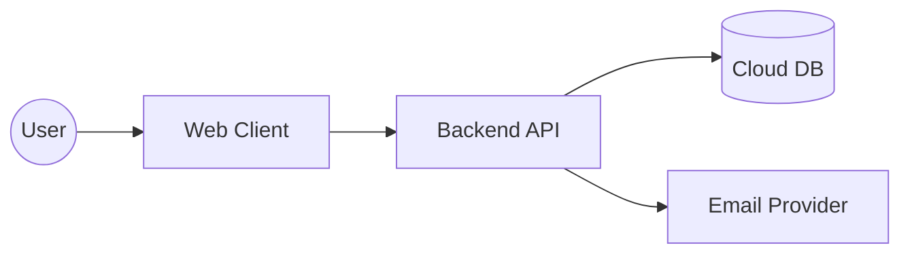

# System architecture (C4-lite)

> Goal: a minimal, living map of the system that helps humans and agents navigate boundaries and dependencies.

## Context (C1)
- Users interact via a web client.
- The server exposes HTTP APIs and integrates with email provider(s).
- Data is stored in a managed cloud database.

## Containers (C2)

## Key modules
- Client: `src/client/*`
- Server: `src/server/*`
- DB: migrations in `db/migrations/*`

## How to find feature specs
- Global index: `docs/ssot/index.md`
- Feature dossiers: `docs/features/F-*.md`
