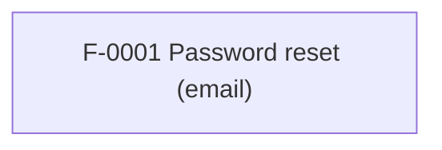

# SSOT Index

> Single-file navigation source of truth.
> **Do not duplicate requirements here.** Link to Feature Dossiers instead.

_Last sync: 2026-03-25T00:18:36.194Z_

## Features

<!-- BEGIN GENERATED FEATURES -->
| ID | Title | Status | Coverage | Area | Depends on | Impacts | Dossier |
|---|---|---|---|---|---|---|---|
| F-0001 | Password reset (email) | planned | deferred | auth | — | client,server,db | `../features/F-0001-password-reset.md` |
<!-- END GENERATED FEATURES -->

## Dependency graph

<!-- BEGIN GENERATED DEP_GRAPH -->

<!-- END GENERATED DEP_GRAPH -->

## Red flags

<!-- BEGIN GENERATED RED_FLAGS -->
- ✅ No red flags detected.
<!-- END GENERATED RED_FLAGS -->
