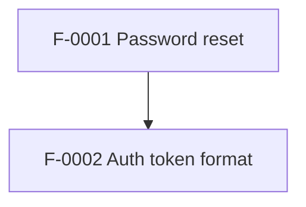

# Global SSOT Index Template (`docs/ssot/index.md`)

> Purpose: single file that answers “where is it described?” and provides a dependency/coverage overview.  
> Rule: **Do not restate requirements text here.** Only metadata + links.

## Features

| ID | Title | Status | Area | Depends on | Impacts | Dossier |
|---|---|---|---|---|---|---|
| F-0001 | Password reset (email) | proposed | auth | — | client,server,db | `../features/F-0001-password-reset.md` |

## ADRs

| ADR ID | Status | Scope | Link |
|---|---|---|---|
| ADR-F0001-01 | Proposed | feature-local | `../features/F-0001-password-reset.md#adr-f0001-01-store-reset-tokens-hashed` |
| ADR-2026-03-04-auth-token-format | Accepted | cross-cutting | `../adr/ADR-2026-03-04-auth-token-format.md` |

## Dependency graph (Mermaid)

## Red flags (generated)

- Dossiers missing required metadata
- Acceptance criteria missing tests
- Unknown dependencies or cycles
- Broken links
