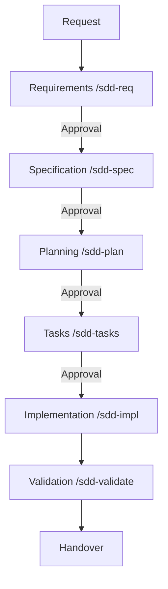
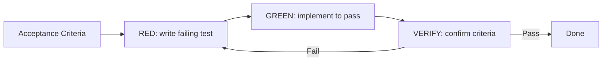
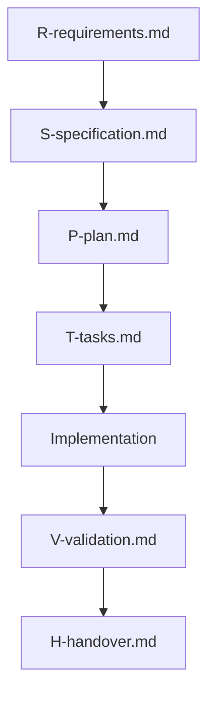

# SDD Diagrams (Mermaid)

Use these diagrams for quick visual orientation. Prefer text checklists for execution.

## Core Workflow

## RED / GREEN / VERIFY (Optional TDD)

Use only when TDD is explicitly requested.

## Artifact Traceability

