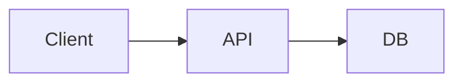

# Specification Template

Use this template when creating technical specifications.

---

```markdown
# Technical Specification: {FEATURE_TITLE}

**Ticket**: {TICKET_ID}
**Author**: {agent/human}
**Date**: {YYYY-MM-DD}
**Status**: Draft | In Review | Approved
**Relevant Skills**: {skill names or None}

**Requirements Reference**: `docs/sdd/{TICKET_ID}/R{N}-requirements.md`

## Problem Statement

{Clear description of the problem being solved - what's broken or missing}

## Proposed Solution

{High-level description of the solution approach}

## Requirements Coverage

| Requirement | Solution Approach |
|-------------|-------------------|
| US-1 | {How US-1 will be satisfied} |
| AC-1.1 | {How AC-1.1 will be implemented} |
| NFR-P1 | {How performance requirement will be met} |

## Affected Components

| Component | Path | Change Type | Description |
|-----------|------|-------------|-------------|
| {Name} | `src/path/file.ts` | new | {What's being added} |
| {Name} | `src/path/file.ts` | modify | {What's changing} |
| {Name} | `src/path/file.ts` | delete | {What's being removed} |

## Architecture

### System Context
{How this feature fits into the overall system}

### Component Diagram


### Data Flow
{Description of how data moves through the system}

## Data Models

### New Models

```typescript
interface {ModelName} {
  id: string;
  field1: string;
  field2: number;
  createdAt: Date;
}
```

### Modified Models

```typescript
// Existing: User
// Adding: lastLoginAt field
interface User {
  // ... existing fields
  lastLoginAt?: Date;  // NEW
}
```

### Database Changes

| Table | Change | SQL/Migration |
|-------|--------|---------------|
| users | Add column | `ALTER TABLE users ADD COLUMN last_login_at TIMESTAMP` |

## API Contracts

### New Endpoints

```
POST /api/v1/{resource}
Request:
{
  "field1": "string",
  "field2": number
}

Response (201):
{
  "id": "string",
  "field1": "string",
  "field2": number,
  "createdAt": "ISO8601"
}

Response (400):
{
  "error": "Validation error",
  "details": [...]
}
```

### Modified Endpoints

| Endpoint | Change |
|----------|--------|
| GET /api/v1/users | Add `lastLoginAt` to response |

## Error Handling

| Error Condition | Error Code | Message | HTTP Status |
|-----------------|------------|---------|-------------|
| Invalid input | VALIDATION_ERROR | "Field X is required" | 400 |
| Not found | NOT_FOUND | "Resource not found" | 404 |
| Unauthorized | AUTH_ERROR | "Invalid credentials" | 401 |

## Security Considerations

### Authentication
{How authentication is handled}

### Authorization
{What permissions are required}

### Data Protection
{How sensitive data is protected}

### Input Validation
{What validation is performed}

## Performance Considerations

### Expected Load
- Requests/second: {estimate}
- Data volume: {estimate}

### Optimization Strategies
- {Caching approach}
- {Query optimization}
- {Indexing strategy}

### Benchmarks
| Operation | Target | Measurement Method |
|-----------|--------|-------------------|
| API response | < 200ms | Load test |
| DB query | < 50ms | Query analyzer |

## Testing Strategy

### Unit Tests
- {Component} - {What to test}

### Integration Tests
- {Flow} - {What to verify}

### E2E Tests
- {Scenario} - {User journey to test}

## Alternatives Considered

| Approach | Pros | Cons | Decision |
|----------|------|------|----------|
| Option A | {benefits} | {drawbacks} | Selected |
| Option B | {benefits} | {drawbacks} | Rejected: {reason} |

## Migration Plan

### Data Migration
{How existing data will be migrated}

### Rollback Plan
{How to rollback if something goes wrong}

### Feature Flags
{If using feature flags, how they'll work}

## Open Technical Questions

- [ ] {Technical decision to be made}

---

**Approval**:
- [ ] Tech Lead: {name} - {date}
- [ ] Security: {name} - {date} (if security-relevant)
```

---

## Template Usage Notes

1. **Don't include code** - Reference files and functions by name
2. **No line numbers** - They change; use function names
3. **Cover all requirements** - Every requirement needs a solution
4. **Be specific about changes** - "Modify file" is not enough
5. **Security is not optional** - Always consider security implications
6. **Alternatives show thinking** - Document why you chose this approach
7. **Use emojis for status/highlights** - e.g., ✅ Approved, ⚠️ Risk
