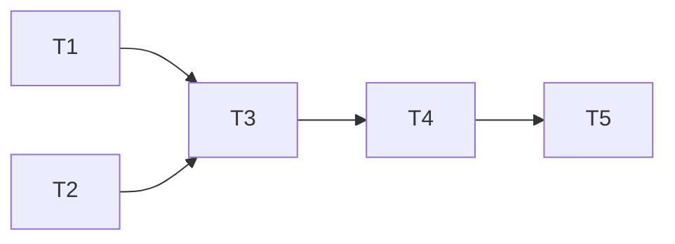

# Tasks Template

Use this template when creating task breakdowns.

---

```markdown
# Tasks: {FEATURE_TITLE}

**Ticket**: {TICKET_ID}
**Author**: {agent/human}
**Date**: {YYYY-MM-DD}
**Status**: Draft | Approved | In Progress | Completed

**Plan Reference**: `docs/sdd/{TICKET_ID}/P{N}-plan.md`
**Relevant Skills**: {skill names or None}

## Task Overview

| ID | Task | Status | Dependencies | Parallel | Effort |
|----|------|--------|--------------|----------|--------|
| T1 | {Short description} | ⏳ pending | - | yes | small |
| T2 | {Short description} | ⏳ pending | - | yes | medium |
| T3 | {Short description} | ⏳ pending | T1 | no | medium |
| T4 | {Short description} | ⏳ pending | T2, T3 | no | small |
| T5 | {Short description} | ⏳ pending | T4 | yes | small |

**Legend**:
- **Status**: `⏳ pending` | `🔄 in_progress` | `⛔ blocked` | `✅ completed` | `❌ failed`
- **Effort**: small (< 15min) | medium (15-30min) | large (30-60min)

## Quality Policy

- Code tasks are complete only when all gate checks pass.
- Tests are mandatory for every new/changed behavior and must be honest/effective.
- Each code task must include explicit gate commands for `type-check`, `test:*`, and lint/format where applicable (`lint:test:fix` for server test changes).
- If the package has split test kinds, each code task must include all of: `test:unit`, `test:integration`, `test:e2e`.
- If the package provides `test:coverage`, add explicit coverage checkpoint tasks and run at least one final-stage coverage gate before closure.

## Status Sync Policy (required)

After each task transition (`🔄 in_progress`, `⛔ blocked`, `✅ completed`, `❌ failed`), update all of:
- Task Overview row
- Task detail section `Status`
- Progress Log entry with timestamp + evidence/notes

Do not batch status updates at the end of the stage.

## Dependency Graph


```mermaid
flowchart LR
  T1 --> T3 --> T4 --> T5
  T2 --> T3
```

## Parallel Execution Groups

**Group 1** (can start immediately):
- T1, T2

**Group 2** (after Group 1):
- T3 (needs T1)

**Group 3** (after Group 2):
- T4 (needs T2, T3)

**Group 4** (after Group 3):
- T5 (needs T4)

## Task Details

---

### T1: {Task Title}

**Status**: ⏳ pending
**Dependencies**: none
**Parallel**: yes
**Effort**: small

**Description**:
{Detailed description of what needs to be done}

**Files**:
- `src/path/file.ts` - {what to do}

**Verification**:
- [ ] {Specific check 1}
- [ ] {Specific check 2}

**Gate Validation**:
- [ ] `{package_cmd} type-check`
- [ ] `{package_cmd} test:*`
- [ ] `{package_cmd} lint:fix` or `{package_cmd} format` (as applicable)
- [ ] `{package_cmd} test:coverage` (required for coverage checkpoint tasks and at least final stage closure when available)

**Notes**:
- {Implementation hint}
- {Gotcha to watch for}

**Owner Input Required** (if applicable):
- Missing input: {explicit field/value list, no wildcards}
- Why agent cannot derive it: {reason}
- Source candidates: {exact files/links/systems/owners}
- Question to owner: {single concrete request}
- Decision options (critical choices only): `A` {tradeoffs} / `B` {tradeoffs}
- Blocking task: {T*}

---

### T2: {Task Title}

**Status**: ⏳ pending
**Dependencies**: none
**Parallel**: yes
**Effort**: medium

**Description**:
{Detailed description of what needs to be done}

**Files**:
- `tests/path/file.test.ts` - {what to do}

**Verification**:
- [ ] {Specific check}

**Gate Validation**:
- [ ] `{package_cmd} type-check`
- [ ] `{package_cmd} test:*`
- [ ] `{package_cmd} lint:fix` or `{package_cmd} format` (as applicable)
- [ ] `{package_cmd} test:coverage` (required for coverage checkpoint tasks and at least final stage closure when available)

**Notes**:
- {Implementation hint}

---

### T3: {Task Title}

**Status**: ⏳ pending
**Dependencies**: T1
**Parallel**: no
**Effort**: medium

**Description**:
{Detailed description}

**Files**:
- `src/path/file.ts`

**Verification**:
- [ ] {Specific check}

**Gate Validation**:
- [ ] `{package_cmd} type-check`
- [ ] `{package_cmd} test:*`
- [ ] `{package_cmd} lint:fix` or `{package_cmd} format` (as applicable)
- [ ] `{package_cmd} test:coverage` (required for coverage checkpoint tasks and at least final stage closure when available)

**Blocked By**: T1 must complete first because {reason}

---

### T4: {Task Title}

**Status**: ⏳ pending
**Dependencies**: T2, T3
**Parallel**: no
**Effort**: small

**Description**:
{Detailed description}

**Files**:
- `src/path/file.ts`
- `tests/path/file.test.ts`

**Verification**:
- [ ] All tests pass
- [ ] {Additional check}

**Gate Validation**:
- [ ] `{package_cmd} type-check`
- [ ] `{package_cmd} test:*`
- [ ] `{package_cmd} lint:fix` or `{package_cmd} format` (as applicable)
- [ ] `{package_cmd} test:coverage` (required for coverage checkpoint tasks and at least final stage closure when available)

---

### T5: {Task Title}

**Status**: ⏳ pending
**Dependencies**: T4
**Parallel**: yes (with other independent work)
**Effort**: small

**Description**:
{Detailed description}

**Files**:
- `docs/path/file.md`

**Verification**:
- [ ] Documentation updated
- [ ] Links valid

**Gate Validation**:
- [ ] Evidence of relevant package gates is recorded in progress log/handover
- [ ] Coverage checkpoint evidence recorded (if package exposes coverage command)

---

## Progress Log

| Timestamp | Task | Action | Notes |
|-----------|------|--------|-------|
| {time} | T1 | 🔄 in_progress | - |
| {time} | T1 | ✅ completed | All checks pass |
| {time} | T2 | 🔄 in_progress | - |
| {time} | T3 | ⛔ blocked | Waiting on T1 |

## Issues Encountered

| Task | Issue | Resolution |
|------|-------|------------|
| T2 | {Problem} | {How it was resolved} |
```

---

## Template Usage Notes

1. **Every task has verification** - Checkboxes for completion criteria
2. **Dependencies explicit** - List what must complete first
3. **Parallel = no file overlap** - Tasks can't both modify same file
4. **Effort estimates help planning** - But don't treat as commitments
5. **Progress log is required** - Record every task transition with timestamp and evidence
6. **Issues section captures learnings** - Helps future work
7. **Every code task has Gate Validation** - Must include `type-check`, `test:*`, and lint/format commands
8. **No optional test execution wording** - Avoid "if test runner exists"
9. **Owner input asks must be concrete** - No wildcard requests; include sources and explicit A/B tradeoff choices when critical
