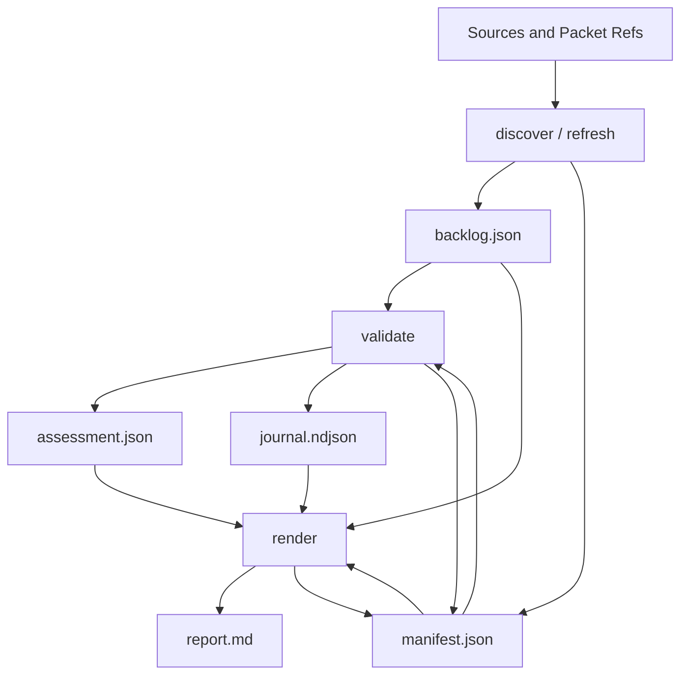
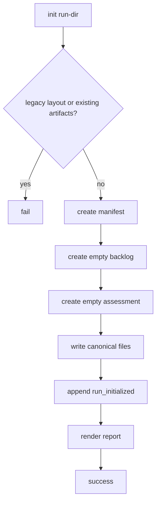
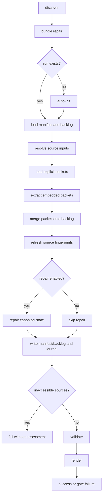
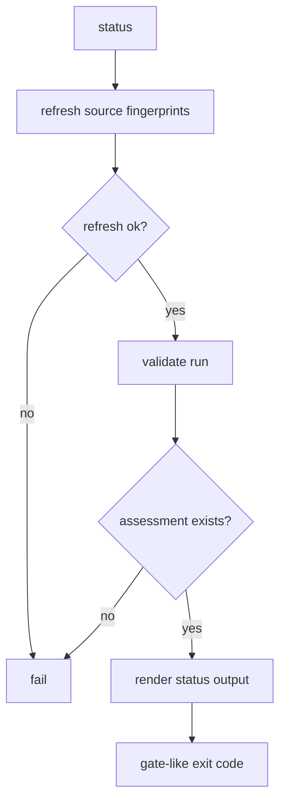
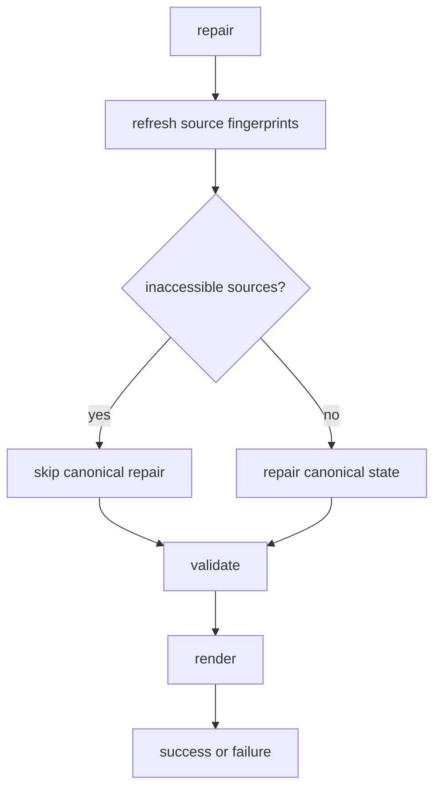
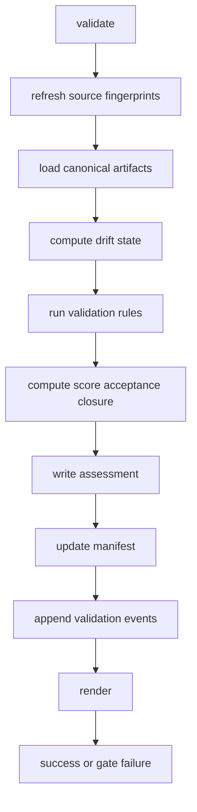
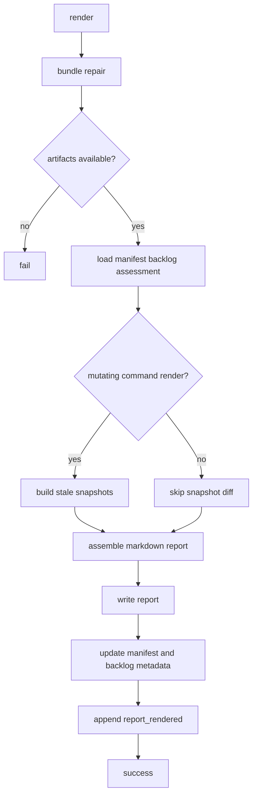
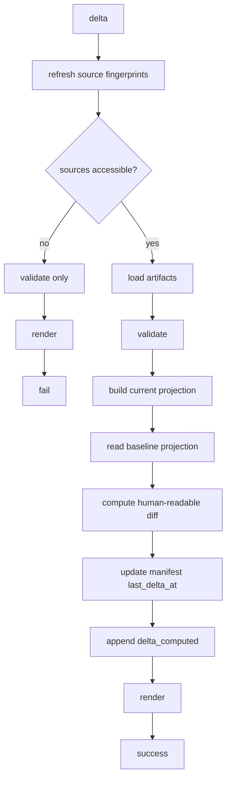
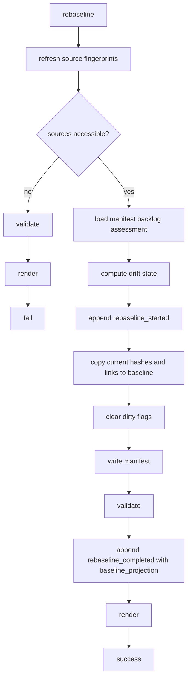
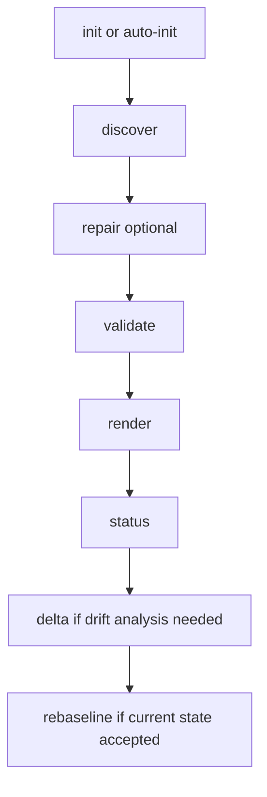

# Спецификация текущей утилиты `architecture-backlog-engineer`

Статус документа: описание фактической реализации "как есть", без предлагаемых изменений.

Основные источники:

- [SKILL.md](/home/kostysh/.codex/skills/custom/skills/architecture-backlog-engineer/SKILL.md)
- [artifact-model.md](/home/kostysh/.codex/skills/custom/skills/architecture-backlog-engineer/references/artifact-model.md)
- [packet-schema.md](/home/kostysh/.codex/skills/custom/skills/architecture-backlog-engineer/references/packet-schema.md)
- [src/cli.ts](/home/kostysh/.codex/skills/custom/skills/architecture-backlog-engineer/src/cli.ts)
- модули в [src/discovery](/home/kostysh/.codex/skills/custom/skills/architecture-backlog-engineer/src/discovery)

## 1. Общее назначение

Утилита materialize-ит и обслуживает discovery run для архитектурного backlog graph.

Ключевая идея:

1. Агент или оператор готовит source refs и packet refs.
2. CLI читает источники и packet-ы.
3. CLI мержит packet contents в canonical graph.
4. CLI пересчитывает derivable state, drift, assessment и report.

Утилита не извлекает смысл из prose сама по себе. Она умеет:

- читать source refs;
- извлекать embedded packet blocks;
- читать explicit packet files;
- детерминированно мержить их в run;
- пересчитывать derived state;
- валидировать и рендерить.

## 2. Командная поверхность

Основной entrypoint:

```bash
node scripts/architecture-backlog.mjs <command> [options]
```

Основные команды:

- `init`
- `discover`
- `status`
- `repair`
- `validate`
- `render`
- `delta`
- `rebaseline`

Совместимые alias-команды:

- `init-discovery-run`
- `discover-discovery-run`
- `status-discovery-run`
- `repair-discovery-run`
- `validate-discovery-run`
- `render-discovery-views`
- `delta-discovery-run`
- `rebaseline-discovery-run`

Глобальные правила:

- у lifecycle-команд всегда ровно один `<run-dir>`;
- неизвестные флаги или неверная форма аргументов дают `exit code 2`;
- runtime или validation failure дают `exit code 1`;
- обычный успех даёт `exit code 0`;
- `status`, `validate`, `delta`, `rebaseline` не являются read-only: они обновляют canonical artifacts.

## 3. Глоссарий терминов

| Термин | Что означает | Для чего нужен |
| --- | --- | --- |
| `discovery run` | Рабочее состояние одного backlog-анализа в отдельной директории | Чтобы утилита могла накапливать canonical state, drift и lineage между командами |
| `compact run bundle` | Набор из `manifest.json`, `backlog.json`, `assessment.json`, `journal.ndjson`, `report.md` | Это файловый контракт текущей утилиты |
| `canonical artifact` | Файл, который несёт process continuity: `manifest`, `backlog`, `assessment`, `journal` | На них опираются все mutating и validation-команды |
| `generated report` | `report.md`, собранный из canonical state | Человекочитаемое представление, которое можно пересобрать в любой момент |
| `source` | Зарегистрированный внешний источник: документ, ADR, runtime evidence, planning text | Из него утилита берёт source identity и fingerprint |
| `source authority` | Класс доверия источника: target truth, current truth, planning only и т.д. | Определяет, что источник имеет право менять в backlog |
| `packet` | JSON envelope с `source`, `packet_provenance` и section payloads | Это атомарная единица загрузки/обновления backlog data |
| `packet provenance` | Merge-контекст packet-а | Чтобы CLI понимал, как именно мержить содержимое packet-а |
| `merge mode` | Режим merge: `source_driven_refresh` или `planning_overlay` | Разделяет authoritative refresh и planning-only edit |
| `source_driven_refresh` | Packet, основанный на authoritative source | Используется для загрузки target truth, current truth и их refresh |
| `planning_overlay` | Packet, меняющий только planning intent без заявления о новой delivery truth | Используется для dependency, owner, spike, roadmap edits |
| `section` | Один top-level ledger или graph section внутри `backlog.json` | Это единица merge-а: `items`, `relations`, `claims` и т.д. |
| `entry` | Одна запись внутри section | Merge обычно идёт по entry-specific ID |
| `upsert` | Merge-стратегия “обновить существующее по identity или добавить новое” | Базовый режим обновления почти для всех section-ов |
| `replace_sections` | Полная замена указанных section-ов содержимым packet-а | Используется только для полного authoritative refresh section-а |
| `baseline` | Последний принятый эталон source/canonical state | Нужен для drift detection и `delta` / `rebaseline` |
| `current state` | Актуальное состояние run-а после последней mutating команды | С ним сравниваются baseline и stale artifacts |
| `drift` | Расхождение между baseline и current state | Основа для dirty flags, stale и rebaseline decisions |
| `dirty flag` | Нормализованная причина drift-а | Показывает, какая поверхность изменилась: source, contract, topology и т.д. |
| `stale artifact` | Артефакт, который больше нельзя считать актуальным для current state | Чтобы утилита не опиралась на устаревшие proofs и reviews |
| `assessment` | Вычисленный validation/governance слой | Даёт pass/fail, score, acceptance, closure и next actions |
| `rebaseline` | Принятие current state как нового baseline | Обнуляет drift для уже принятого состояния |
| `journal lineage` | Лента lifecycle и baseline/delta snapshots в `journal.ndjson` | Нужна для отчётности, delta и history-aware render-а |
| `track` | Один из обязательных delivery envelope-ов методики | Через tracks проверяется, что backlog ведёт к реальной работающей системе |
| `track gate` | Обязательное условие закрытия track-а | Определяет needed proofs и recalculation triggers |
| `proof bundle` | Evidence-запись для item/claim/current-truth assertions | Связывает backlog с проверяемыми доказательствами |
| `track proof` | Сводка покрытия proofs для одного track-а | Показывает, что track подтверждён целостным набором evidence |
| `review artifact` | Governance approval/findings artifact | Нужен для coverage по review roles и closure logic |
| `waiver` | Формализованное исключение из review/control требования | Позволяет объяснимо ослабить governance rule |
| `roadmap matrix` | Упорядоченная матрица roadmap rows по items и relations | Используется для ordering, dependency rendering и roadmap checks |

## 4. Модель данных

### 4.1. Канонические и производные артефакты

Фактический compact run bundle состоит из пяти файлов:

| Артефакт | Роль |
| --- | --- |
| `manifest.json` | Метаданные run, baseline/current snapshots, dirty flags, last_* timestamps |
| `backlog.json` | Канонический backlog graph и все доменные ledger-ы |
| `assessment.json` | Вычисленный assessment layer |
| `journal.ndjson` | Лента lifecycle и lineage событий |
| `report.md` | Производный человекочитаемый read model |

С точки зрения утилиты canonical truth живёт в первых четырёх файлах. `report.md` rebuild-ится из canonical state.

Отдельная важная деталь:

- каталог `packets/` не входит в canonical continuity contract run-а;
- packet files могут лежать рядом с run-ом, но утилита не считает их обязательными methodology-owned artifacts.

### 4.2. Структура `manifest.json`

`Manifest` хранит только run-level метаданные:

- `schema_version`
- `run_id`
- `created_at`, `updated_at`
- `phase_state`
- `acceptance_target`
- `baseline_source_hashes`, `current_source_hashes`
- `baseline_canonical_hashes`, `current_canonical_hashes`
- `baseline_issue_item_links`, `current_issue_item_links`
- `dirty_flags`
- `last_assessment_status`
- `last_render_at`
- `last_delta_at`
- `last_rebaseline_at`
- `last_rebaseline_causes`
- `legacy_layout_detected`

Смысл:

- `manifest` не хранит backlog graph;
- он хранит метаданные текущего и baseline состояния, достаточные для drift/rebaseline/status logic.

| Поле | Что означает | Для чего нужно |
| --- | --- | --- |
| `schema_version` | Версия схемы manifest | Чтобы утилита отвергала несовместимые bundle-ы |
| `run_id` | Стабильный идентификатор run-а | Связывает между собой все canonical files и journal events |
| `created_at` | Время первой инициализации run-а | Нужен для lifecycle traceability |
| `updated_at` | Время последней записи в manifest | Показывает последний lifecycle update |
| `phase_state` | Текущая стадия жизненного цикла run-а | Даёт быстрый coarse-grained сигнал, насколько run заполнен |
| `acceptance_target` | Целевой уровень acceptance для run-а | От него зависит pass/fail logic по acceptance |
| `baseline_source_hashes` | Fingerprints источников на момент baseline | Основа для source drift detection |
| `current_source_hashes` | Fingerprints источников в текущем состоянии | Позволяет сравнить current state с baseline |
| `baseline_canonical_hashes` | Hash-и canonical slices на момент baseline | Основа для non-source drift detection |
| `current_canonical_hashes` | Hash-и canonical slices в текущем состоянии | Позволяет понять, какие canonical surfaces изменились |
| `baseline_issue_item_links` | Snapshot связи issues с items на baseline | Нужен для drift и false-closure detection |
| `current_issue_item_links` | Текущая snapshot-связка issues и items | Нужна для сравнения с baseline |
| `dirty_flags` | Нормализованные причины drift-а | Используются в status, delta, rebaseline readiness и render |
| `last_assessment_status` | Последний итог validate: `not-run`, `pass`, `fail` | Быстрый summary без чтения `assessment.json` |
| `last_render_at` | Когда последний раз был пересобран `report.md` | Показывает freshness human-readable report-а |
| `last_delta_at` | Когда последний раз выполнялся `delta` | Нужен для lifecycle и stale-review logic |
| `last_rebaseline_at` | Когда текущий baseline был принят | Используется для rebaseline lineage и stale-review logic |
| `last_rebaseline_causes` | Какие dirty flags привели к последнему rebaseline | Даёт объяснение, почему baseline был переписан |
| `legacy_layout_detected` | Признак старого несовместимого layout-а run-а | Блокирует normal workflow и требует migration/repair |

Разрешённые `phase_state` и их смысл:

- `initialized`: run создан, но источники ещё не зарегистрированы.
- `sources_resolved`: есть `source_authority`, но ещё нет target-system reconstruction.
- `target_reconstructed`: заполнен `target_system`.
- `as_built_reconstructed`: заполнен `as_built`.
- `claims_extracted`: появились `claims`.
- `graph_built`: появились `items`, то есть backlog graph уже materialized.
- `sliced`: enum существует в модели, но текущая реализация его не выставляет автоматически.
- `validated`: validate завершился `pass` и run ещё не rendered/closed.
- `rendered`: последний mutating tail или явный render закончил rebuild `report.md`.
- `closed`: enum существует в модели, но отдельной команды final close в текущем CLI нет.

Разрешённые `acceptance_target`:

- `draft-only`: нужен только минимальный черновой уровень.
- `planning-grade`: run должен быть пригоден для planning.
- `implementation-grade`: run должен быть пригоден для implementation/closure.

Разрешённые `dirty_flags`:

- `source_change`, `contract_change`, `topology_change`, `track_gate_change`, `incident_false_closure`, `security_finding`, `nfr_breach`, `external_dependency_change`, `owner_boundary_change`, `release_path_change`.

### 4.3. Структура `backlog.json`

`BacklogFile` хранит весь graph и все ledger-ы:

- `metadata`
- `glossary`
- `aliases`
- `id_strategy`
- `source_authority`
- `source_exclusions`
- `target_system`
- `value_streams`
- `tracks`
- `track_gates`
- `track_journeys`
- `as_built`
- `claims`
- `negative_scope`
- `quality_attributes`
- `policy_decisions`
- `contracts`
- `data_domains`
- `gaps`
- `contradictions`
- `unknowns`
- `uncertainty_to_spike`
- `delivered_lineage_notes`
- `items`
- `relations`
- `proofs`
- `track_proofs`
- `reviews`
- `waivers`
- `roadmap_matrix`

Это и есть canonical graph payload.

`metadata` внутри `backlog.json`:

| Поле | Что означает | Для чего нужно |
| --- | --- | --- |
| `schema_version` | Версия схемы backlog file | Проверка совместимости с CLI |
| `run_id` | Идентификатор run-а | Связь с manifest/assessment/journal |
| `created_at` | Время создания backlog file | Audit trail |
| `updated_at` | Время последнего изменения backlog payload | Позволяет видеть freshness canonical graph |

Секции `backlog.json`:

| Поле | Что означает | Для чего нужно |
| --- | --- | --- |
| `glossary` | Карта `canonical_term -> объяснение` | Нормализует словарь backlog-а и терминологию |
| `aliases` | Карта `canonical_term -> список синонимов` | Позволяет свести разные обозначения к одному термину |
| `id_strategy` | Правила именования ID по ledger classes | Делает ID minting детерминированным |
| `source_authority` | Реестр зарегистрированных источников | Определяет authoritative/planning basis run-а |
| `source_exclusions` | Реестр намеренно исключённых или superseded sources | Объясняет, почему некоторые источники больше не учитываются |
| `target_system` | Реконструкция intended target-state системы | Фиксирует, какой system end-state должна достигнуть roadmap |
| `value_streams` | Пользовательские и операционные потоки ценности | Связывают tracks и journeys с реальными workflow |
| `tracks` | Обязательные delivery envelopes методики | Проверяют, что roadmap ведёт к работающей и поддерживаемой системе |
| `track_gates` | Обязательные gates для закрытия tracks | Фиксируют fail-open/fail-closed правила и нужные proofs |
| `track_journeys` | Representative journeys для tracks | Показывают конкретные сценарии, которыми track подтверждается |
| `as_built` | Реконструкция текущей runtime/deployment topology | Фиксирует, как система реально устроена сейчас |
| `claims` | Архитектурные утверждения и обязательства | Из них выводятся backlog items, controls и доказуемые требования |
| `negative_scope` | Сознательно исключённые области | Защищает от ложных ожиданий и scope creep |
| `quality_attributes` | Ledger NFR-целей | Фиксирует non-functional obligations и их owners/proofs |
| `policy_decisions` | Ledger policy-решений и policy-needs | Хранит необходимые, отложенные или принятые policy решения |
| `contracts` | Ledger интерфейсных и интеграционных контрактов | Нужен для traceability и contract drift |
| `data_domains` | Ledger data ownership и classification | Нужен для data boundaries и traceability |
| `gaps` | Явно обнаруженные пробелы | Показывают, чего не хватает для целевой системы |
| `contradictions` | Конфликты между источниками или утверждениями | Показывают места, где truth model противоречива |
| `unknowns` | Неразрешённые вопросы | Показывают неопределённости, мешающие closure |
| `uncertainty_to_spike` | Timeboxed spikes, созданные из unknowns | Даёт bounded способ разрулить неопределённость |
| `delivered_lineage_notes` | Ноты о lineage уже доставленной функциональности | Помогают связывать current truth с backlog graph |
| `items` | Основные backlog nodes | Это executable graph: seams, slices, controls, migrations и т.д. |
| `relations` | Graph edges между сущностями backlog-а | Задают dependency, decomposition, governance и другие связи |
| `proofs` | Proof bundles / evidence entries | Доказывают delivery, runtime truth и closure conditions |
| `track_proofs` | Сводки proof coverage по tracks | Показывают, что track подтверждён полным набором evidence |
| `reviews` | Review artifacts по items/run/track_proofs | Обеспечивают governance coverage |
| `waivers` | Формализованные исключения из governance требований | Делают отклонения явными и проверяемыми |
| `roadmap_matrix` | Упорядоченные roadmap rows по items | Используется для dependency-aware ordering и rendering |

### 4.4. Структура `assessment.json`

`AssessmentFile` хранит вычисленный слой:

- `status`
- `errors`, `warnings`, `hard_fails`, `lint_findings`
- `stale_claims`, `stale_items`, `stale_proofs`, `stale_review_artifacts`
- `track_gate_failures`
- `required_review_roles`, `present_review_roles`, `missing_review_roles`
- `pending_track_proof_reviews`
- `waiver_findings`, `invalid_waiver_ids`
- `next_actions`
- `score`
- `acceptance`
- `closure`
- `delta_summary`
- `rebaseline_required`
- `rebaseline_readiness`
- `stats`

`assessment.json` не редактируется руками; он materialize-ится из `manifest + backlog + drift + validation`.

Основные поля `assessment.json`:

| Поле | Что означает | Для чего нужно |
| --- | --- | --- |
| `schema_version` | Версия схемы assessment file | Совместимость assessment с CLI |
| `run_id` | Идентификатор run-а | Связь assessment с bundle |
| `assessed_at` | Время последнего authoritative validate | Показывает свежесть computed state |
| `status` | Общий результат validate: `pass` или `fail` | Используется в `status`, `render` и exit-code logic |
| `errors` | Validation errors | Основной список найденных проблем |
| `warnings` | Нестрогие нарушения | Помогают видеть слабые места без hard-fail |
| `hard_fails` | Блокирующие нарушения | Именно они мешают acceptance и closure |
| `lint_findings` | Методологические замечания и soft findings | Даёт более granular governance feedback |
| `stale_proofs` | ID устаревших proofs | Показывает, какой evidence надо refresh-нуть |
| `stale_items` | ID items, затронутых stale/drift logic | Показывает nodes, потерявшие надёжное основание |
| `stale_claims` | ID claims, ставших stale | Нужны для claim drift visibility |
| `stale_review_artifacts` | ID reviews, больше не пригодных для current state | Не дают использовать устаревшие approvals |
| `track_gate_failures` | Список track gate failures | Показывает, какие closure gates не пройдены |
| `required_review_roles` | Роли, которые должны присутствовать по методике | Основа review coverage logic |
| `present_review_roles` | Роли, реально присутствующие в valid reviews | Показывает текущее покрытие review roles |
| `missing_review_roles` | Роли, которых не хватает | Даёт конкретный action list по reviews |
| `pending_track_proof_reviews` | Track proofs, которым нужны reviews | Помогает закрывать review debt по tracks |
| `waiver_findings` | Findings по waiver usage | Показывает проблемы с waiver governance |
| `invalid_waiver_ids` | ID waiver-ов, которые validator считает некорректными | Нужны для cleanup governance exceptions |
| `next_actions` | Краткий action-oriented remediation list | Это основной операторский вывод из validate |
| `score` | Итоговый score breakdown | Используется для planning-grade / implementation-grade checks |
| `acceptance` | Достигнутый и требуемый acceptance state | Показывает, прошёл ли run целевой acceptance threshold |
| `closure` | Текущее closure состояние run-а | Показывает, открыт ли run, planning-ready ли он и т.д. |
| `delta_summary` | Нормализованная сводка drift-а | Доступный summary baseline/current расхождений |
| `rebaseline_required` | Нужен ли rebaseline | Быстрый флаг, что baseline уже устарел |
| `rebaseline_readiness` | Можно ли сейчас rebaseline-ить run | Защищает от premature rebaseline |
| `stats` | Счётчики по graph, stale, reviews, waivers | Дают compact количественную сводку run-а |

Разрешённые `status`:

- `not-run`: assessment ещё не был authoritative-пересчитан для текущего run-а.
- `pass`: canonical artifacts complete и hard-fails отсутствуют.
- `fail`: validate нашёл blocking issues или run неполон.

Объект `score`:

| Поле | Что означает | Для чего нужно |
| --- | --- | --- |
| `total` | Набранные баллы | Используется для acceptance floor checks |
| `max` | Максимально возможные баллы | Делает итоговый score интерпретируемым |
| `sections` | Декомпозиция score по секциям | Позволяет понять, где именно теряются баллы |

Поля каждого `score.sections[]` entry:

| Поле | Что означает | Для чего нужно |
| --- | --- | --- |
| `id` | Стабильный идентификатор score section | Чтобы одинаково рендерить и сравнивать секции |
| `label` | Человекочитаемое имя секции | Для отчёта и operator UX |
| `max` | Верхний потолок баллов секции | Для локального нормирования |
| `score` | Реально набранные баллы секции | Показывает качество в данной области |
| `reason` | Краткое объяснение результата | Даёт operator-level интерпретацию score |

Объект `acceptance`:

| Поле | Что означает | Для чего нужно |
| --- | --- | --- |
| `target` | Целевой acceptance class из manifest | Показывает, к какому уровню стремится run |
| `achieved` | Реально достигнутый acceptance class | Показывает фактическое качество run-а |
| `target_satisfied` | Выполнен ли target acceptance | Нужен для простого pass/fail по acceptance |
| `blocking_reasons` | Почему target acceptance не достигнут | Даёт конкретное объяснение operator-у |

Объект `closure`:

| Поле | Что означает | Для чего нужно |
| --- | --- | --- |
| `status` | `open`, `planning_ready` или `implementation_ready` | Быстрый coarse-grained итог жизненного цикла run-а |
| `reason` | Почему выставлен именно этот closure status | Даёт объяснимость результата |

Объект `delta_summary`:

| Поле | Что означает | Для чего нужно |
| --- | --- | --- |
| `baseline_established` | Существует ли baseline snapshot | Без baseline часть drift/delta logic ограничена |
| `changed_source_ids` | Источники, чьи fingerprints изменились | Показывает source-driven drift |
| `changed_claim_ids` | Claims, чьё состояние изменилось относительно baseline | Показывает claim drift |
| `stale_claim_ids` | Claims, утратившие валидность | Основа stale-claim reporting |
| `stale_item_ids` | Items, затронутые stale logic | Основа stale-item reporting |
| `stale_proof_ids` | Proofs, ставшие stale | Основа stale-proof reporting |
| `stale_review_artifact_ids` | Reviews, ставшие stale | Основа stale-review reporting |
| `track_gate_ids_to_recalculate` | Gates, которым нужен recalculation | Даёт action surface для tracks |
| `dirty_flags` | Нормализованные причины drift-а | Используются в status, render и rebaseline |
| `topology_changed` | Краткий флаг, что topology drift обнаружен | Быстрый shortcut для operator-а |
| `contract_changed` | Краткий флаг, что contract drift обнаружен | Быстрый shortcut для operator-а |
| `changed_track_gate_ids` | Gates, чья конфигурация изменилась | Показывает, какие gates реально поменялись |

Объект `rebaseline_readiness`:

| Поле | Что означает | Для чего нужно |
| --- | --- | --- |
| `status` | `allowed`, `blocked` или `not_needed` | Дает простой ответ, можно ли сейчас делать rebaseline |
| `reasons` | Пояснения к readiness status | Показывает, что именно нужно исправить перед rebaseline |

Объект `stats`:

| Поле | Что означает | Для чего нужно |
| --- | --- | --- |
| `sources_total` | Количество sources | Быстрая сводка coverage по источникам |
| `claims_total` | Количество claims | Показывает объём target-truth assertions |
| `contracts_total` | Количество contracts | Быстрая сводка интеграционных обязательств |
| `data_domains_total` | Количество data domains | Показывает размер data-ledger-а |
| `items_total` | Количество уникальных items | Основной объём backlog graph-а |
| `items_delivered` | Items со state `delivered` | Показывает текущую delivery coverage |
| `items_partially_delivered` | Items со state `partially_delivered` | Показывает частично реализованные области |
| `items_not_started` | Items со state `not_started` | Показывает remaining backlog |
| `gaps_total` | Количество gaps | Объём известных пробелов |
| `unknowns_total` | Количество unknowns | Объём открытой неопределённости |
| `contradictions_total` | Количество contradictions | Объём конфликтов в truth model |
| `stale_claims_total` | Количество stale claims | Быстрая stale-claim сводка |
| `stale_items_total` | Количество stale items | Быстрая stale-item сводка |
| `stale_proofs_total` | Количество stale proofs | Быстрая stale-proof сводка |
| `stale_review_artifacts_total` | Количество stale reviews | Быстрая stale-review сводка |
| `warnings_total` | Количество warnings | Показывает уровень soft-debt |
| `hard_fails_total` | Количество hard fails | Показывает уровень blocking debt |
| `dor_ready_total` | Items со state `ready` | Быстрая сводка readiness |
| `review_artifacts_total` | Количество reviews | Показывает объём review governance |
| `waivers_total` | Количество waivers | Показывает объём governance exceptions |

### 4.5. Source model

Источник описывается через `SourceAuthorityRef`:

- `source_id`
- `ref`
- `kind`
- `authority`
- `precedence`
- `fingerprint`
- `notes`
- `last_access_status`
- `last_accessed_at`
- `last_access_error`

Смысл:

- `source_authority` живёт внутри `backlog.json`;
- identity источника задаётся комбинацией `ref + kind + authority`;
- CLI не допускает конфликтующую двойную регистрацию той же identity под разными `source_id`.

| Поле | Что означает | Для чего нужно |
| --- | --- | --- |
| `source_id` | Стабильный ID source authority entry | Используется в links, provenance и drift reporting |
| `ref` | Путь или URL на источник | Это физическая привязка к документу или evidence |
| `kind` | Тип source-а | Нужен для валидации и interpretation policy |
| `authority` | Класс доверия source-а | Определяет допустимый scope изменений |
| `precedence` | Порядок при source-authority ordering | Нужен для deterministic source registry и rendering |
| `fingerprint` | Текущий content fingerprint source-а | Основной сигнал для source drift detection |
| `notes` | Человекочитаемое пояснение к source | Даёт operator-level контекст |
| `last_access_status` | `ok` или `inaccessible` | Позволяет рано останавливать workflow при недоступном source |
| `last_accessed_at` | Когда source последний раз читался CLI | Полезно для audit trail |
| `last_access_error` | Последняя ошибка доступа | Помогает диагностировать source failures |

Разрешённые `authority`:

- `authoritative_target_truth`: источник описывает целевую систему.
- `authoritative_current_truth`: источник описывает текущую реальность/доставленное состояние.
- `historical_context_only`: источник нужен только как контекст, не как active truth.
- `superseded_excluded`: источник явно вытеснен новым.
- `planning_only`: источник годится только для planning intent.

Разрешённые `kind`:

- `architecture_doc`: архитектурный обзор или design doc по целевой системе.
- `adr`: architectural decision record.
- `runtime_evidence`: evidence о реально наблюдаемом runtime behavior.
- `deployment_contract`: deployment/runtime contract, влияющий на topology или release path.
- `delivered_dossier_ssot`: delivered feature SSoT из соседней методики.
- `code_evidence`: evidence, извлечённое из исходного кода или code-adjacent артефактов.
- `operational_evidence`: runbooks, incidents, ops-доказательства и support artifacts.
- `backlog_text`: planning/backlog prose, не являющийся authoritative runtime truth.

### 4.6. Packet model

Packet envelope:

- `source`
- `packet_provenance`
- `replace_sections`
- section payloads

Поддерживаемые merge modes:

- `source_driven_refresh`
- `planning_overlay`

Важные правила:

- `replace_sections` разрешён только для `source_driven_refresh`;
- `planning_overlay` может трогать только ограниченный набор секций;
- packet contents не хранятся отдельно как canonical entities;
- после merge в entries materialize-ятся `packet_provenance`, а для source-managed секций ещё и `source_refs`.

Top-level поля packet-а:

| Поле | Что означает | Для чего нужно |
| --- | --- | --- |
| `source` | Identity и metadata источника packet-а | CLI понимает, к какому source authority относится packet |
| `packet_provenance` | Merge-контекст packet-а | CLI понимает режим merge-а и consistency checks |
| `replace_sections` | Список section-ов для полной замены | Даёт controlled destructive refresh для authoritative packets |
| `section payloads` | Собственно данные backlog section-ов | Это доменные данные, которые будут upsert/replaced |

Поля `packet.source`:

| Поле | Что означает | Для чего нужно |
| --- | --- | --- |
| `source_id` | Явный source ID, если автор packet-а хочет его закрепить | Позволяет reuse-ить существующий source authority entry |
| `ref` | Путь или URL на источник packet-а | Формирует physical identity source-а |
| `kind` | Тип источника | Нужен для валидации и merge policy |
| `authority` | Класс доверия источника | Определяет allowable merge behavior |
| `precedence` | Желаемый порядок в source ledger-е | Нужен для deterministic ordering |
| `notes` | Человекочитаемая заметка | Даёт дополнительный контекст оператору |

Поля `packet.packet_provenance`:

| Поле | Что означает | Для чего нужно |
| --- | --- | --- |
| `merge_mode` | Основной режим merge-а | Переключает packet между authoritative refresh и planning overlay |
| `source_authority` | Optional cross-check authority | Позволяет автору packet-а намеренно проверить согласованность |
| `source_id` | Optional cross-check source ID | Позволяет поймать неправильную привязку packet-а к source |
| `source_kind` | Optional cross-check source kind | Позволяет поймать неправильный тип источника |

Разрешённые `merge_mode`:

- `source_driven_refresh`: authoritative packet, может делать section refresh и current-truth updates.
- `planning_overlay`: planning-only packet, не должен заявлять новый authoritative delivery truth и не может использовать `replace_sections`.

### 4.7. Upsert identity по секциям

Для большинства секций upsert идёт по section-specific ID:

| Секция | Identity |
| --- | --- |
| `claims` | `claim_id` |
| `tracks` | `track_id` |
| `track_gates` | `track_gate_id` |
| `track_journeys` | `journey_id` |
| `contracts` | `contract_id` |
| `data_domains` | `domain_id` |
| `gaps`, `contradictions`, `unknowns` | `issue_id` |
| `items` | `item_id` |
| `proofs` | `proof_id` |
| `track_proofs` | `track_proof_id` |
| `reviews` | `review_id` |
| `waivers` | `waiver_id` |
| `roadmap_matrix` | `row_id`, fallback `item_ref.id` |

Для `relations` identity такая:

1. `relation_id`, если он есть
2. иначе canonical tuple:
   `relation_type:from.kind:from.id:to.kind:to.id`

Отдельный важный факт:

- `packet_id` в текущей реализации отсутствует;
- утилита не различает "новую ревизию того же packet" и "ещё один packet того же source" на уровне packet identity;
- merge semantics опирается на `source_id` и entry identities внутри секций.

### 4.8. Drift и stale model

Утилита ведёт:

- baseline source hashes
- current source hashes
- baseline canonical hashes
- current canonical hashes
- baseline/current issue-item links
- dirty flags

`computeDriftState()` строит:

- `changed_source_ids`
- `changed_claim_ids`
- `changed_track_gate_ids`
- `track_gate_ids_to_recalculate`
- `stale_claim_ids`
- `stale_item_ids`
- `stale_proof_ids`
- `dirty_flags`
- `rebaseline_required`

На базе этого `validate` затем вычисляет ещё и `stale_review_artifacts`.

### 4.9. Journal / lineage model

`journal.ndjson` хранит события lifecycle и lineage. Основные события:

- `run_initialized`
- `run_bundle_repaired`
- `source_fingerprints_refreshed`
- `sources_discovered`
- `canonical_repaired`
- `waiver_recorded`
- `track_closed`
- `run_validated`
- `delta_computed`
- `rebaseline_started`
- `rebaseline_completed`
- `report_rendered`

Через journal утилита также хранит:

- `baseline_projection`
- stale snapshots
- new stale snapshots
- issue resolution snapshots

Это используется для:

- human-readable delta;
- rebaseline lineage;
- "New Stale Since Last Change";
- восстановления контекста после mutating command.

### 4.10. Общая схема данных



## 5. Общие вспомогательные алгоритмы

### 5.1. `bundle repair`

Назначение:

- проверить, нет ли legacy layout;
- проверить schema version;
- восстановить отсутствующие `manifest.json`, `assessment.json`, `journal.ndjson`, если `backlog.json` существует;
- не пытаться чинить run, если отсутствует `backlog.json`.

### 5.2. `refresh source fingerprints`

Назначение:

- перечитать все `source_authority[].ref`;
- нормализовать `ref`;
- вычислить новый `fingerprint`;
- пометить changed/inaccessible sources;
- при изменениях записать это обратно в `backlog.json`, `manifest.json`, `journal.ndjson`.

### 5.3. `repair canonical state`

Назначение:

- пересчитать `summary_label` у items/tracks;
- синхронизировать track-derived refs;
- rebuild `roadmap_matrix`.

Это не полный semantic repair, а narrow derivable repair.

## 6. Команды

### 6.1. `init`

#### Назначение

Создать новый compact run bundle и сразу сгенерировать первый `report.md`.

#### Основные входы

- `<run-dir>`
- `--acceptance-target`
- `--force`

#### Читает

- наличие существующих canonical artifacts;
- наличие legacy layout.

#### Пишет

- `manifest.json`
- `backlog.json`
- `assessment.json`
- `journal.ndjson`
- `report.md`

#### Алгоритм

1. Нормализовать `run-dir`.
2. Проверить `acceptance_target`.
3. Проверить legacy layout.
4. Без `--force` запретить инициализацию поверх существующих artifacts.
5. Создать пустой `manifest`.
6. Создать пустой `backlog` с тремя default tracks.
7. Создать empty `assessment`.
8. Записать canonical artifacts.
9. Добавить `run_initialized` в journal.
10. Вызвать `render` с `renderReason=mutating_command`.

#### Mermaid



### 6.2. `discover`

#### Назначение

Разрешить source inputs и packet refs, materialize/update `backlog.json`, опционально починить derivable state, затем validate и render.

#### Основные входы

- `<run-dir>`
- `--acceptance-target`
- typed source flags
- `--source`
- `--source-packet`
- `--no-repair`

#### Читает

- existing run bundle
- source refs
- explicit packet refs
- embedded packet blocks внутри source content

#### Пишет

- `backlog.json`
- `manifest.json`
- `assessment.json`
- `journal.ndjson`
- `report.md`

#### Алгоритм

1. Проверить bundle через `repairCompactRunBundle`.
2. Если run не существует, auto-init.
3. Загрузить `manifest` и `backlog`.
4. Прочитать source inputs и вычислить их fingerprints.
5. Прочитать explicit packet refs.
6. Извлечь embedded packet blocks из sources.
7. Нормализовать source records и packet provenance.
8. Смержить packets в backlog:
   - merge `source_authority`
   - upsert sections по section identities
   - применять `replace_sections`, если разрешено
9. Обновить source fingerprints в backlog.
10. Если repair не отключён, выполнить derivable repair.
11. Обновить `manifest.updated_at` и `phase_state`.
12. Записать `sources_discovered` в journal.
13. Если есть inaccessible sources, вернуть failure до assessment.
14. Вызвать `validate`.
15. Вызвать `render` с `renderReason=mutating_command`.

#### Mermaid



### 6.3. `status`

#### Назначение

Показать текущее состояние run, stale/drift diagnostics и next actions.

#### Основные входы

- `<run-dir>`

#### Читает

- canonical run bundle
- registered source refs
- journal

#### Пишет

- может обновить `backlog.json` и `manifest.json` через refresh source fingerprints
- переписывает `assessment.json` через `validate`
- дописывает journal при refresh/validate

#### Алгоритм

1. Выполнить `refreshRunSourceFingerprints`.
2. При legacy/schema/missing/inaccessible failure выйти с ошибкой.
3. Выполнить `validateDiscoveryRun`.
4. Сгенерировать текст status output из `manifest + assessment + journal`.
5. Вернуть `exit code 0` только если `assessment.pass` и `rebaseline_required=false`.

#### Mermaid



### 6.4. `repair`

#### Назначение

Починить narrow derivable canonical state поверх существующего run, затем validate и render.

#### Основные входы

- `<run-dir>`

#### Читает

- canonical run bundle
- source refs

#### Пишет

- `backlog.json`
- `manifest.json`
- `assessment.json`
- `journal.ndjson`
- `report.md`

#### Алгоритм

1. Выполнить `refreshRunSourceFingerprints`.
2. Если sources недоступны, не делать canonical repair.
3. Иначе вызвать `repairBacklogCanonicalState`:
   - summary labels
   - track derived refs
   - roadmap matrix
4. Если были изменения, записать `canonical_repaired` в journal.
5. Выполнить `validate`.
6. Выполнить `render` с `renderReason=mutating_command`.

#### Mermaid



### 6.5. `validate`

#### Назначение

Пересчитать authoritative `assessment.json` и весь validation/drift/governance слой.

#### Основные входы

- `<run-dir>`

#### Читает

- `manifest.json`
- `backlog.json`
- `assessment.json`
- `journal.ndjson`
- current source refs через refresh fingerprints

#### Пишет

- `assessment.json`
- `manifest.json`
- `journal.ndjson`
- `report.md` через CLI wrapper

#### Алгоритм

1. На CLI-уровне сначала выполнить `refreshRunSourceFingerprints`.
2. Проверить обязательные artifacts и schema version.
3. Загрузить `manifest`, `backlog`, previous `assessment`, `journal`.
4. Вычислить `driftState`:
   - source hashes
   - canonical hashes
   - issue-item links
   - dirty flags
   - stale claims/items/proofs
5. Провести full validation:
   - source authority
   - target/as-built reconstruction
   - claims/contracts/data domains
   - tracks/journeys/gates/track proofs
   - items/relations
   - proofs
   - reviews/waivers/applicability
6. Собрать:
   - errors/warnings/hard fails
   - score
   - acceptance
   - closure
   - rebaseline_readiness
   - next_actions
   - stale_review_artifacts
7. Перезаписать `assessment.json`.
8. Обновить `manifest.current_*`, `dirty_flags`, `last_assessment_status`, при необходимости `phase_state`.
9. Записать journal events:
   - `waiver_recorded`
   - `track_closed`
   - `run_validated`
10. На CLI-уровне вызвать `render` с `renderReason=mutating_command`.

#### Mermaid



### 6.6. `render`

#### Назначение

Rebuild `report.md` из уже существующего canonical state.

#### Основные входы

- `<run-dir>`

#### Читает

- `manifest.json`
- `backlog.json`
- `assessment.json`
- `journal.ndjson`

#### Пишет

- `report.md`
- `manifest.json`
- `backlog.json`
- `journal.ndjson`

#### Алгоритм

1. Выполнить `repairCompactRunBundle`.
2. Убедиться, что canonical artifacts доступны.
3. Загрузить `manifest`, `backlog`, `assessment`.
4. Определить `renderReason`:
   - `recovery_render` по умолчанию
   - `mutating_command`, если вызвано из mutating command wrapper
5. Если `mutating_command`:
   - взять previous stale snapshot
   - построить current stale snapshot
   - построить new stale snapshot
6. Сгенерировать полный markdown report по секциям.
7. Записать `report.md`.
8. Обновить `manifest.last_render_at` и `phase_state=rendered`, если run ещё не `closed`.
9. Обновить `backlog.metadata.updated_at`.
10. Записать `report_rendered` в journal.

#### Mermaid



### 6.7. `delta`

#### Назначение

Пересчитать drift и собрать human-readable diff относительно последнего baseline projection.

#### Основные входы

- `<run-dir>`

#### Читает

- canonical run bundle
- source refs
- baseline projection из journal

#### Пишет

- `assessment.json` через `validate`
- `manifest.json` (`last_delta_at`)
- `journal.ndjson` (`delta_computed`)
- `report.md`

#### Алгоритм

1. Выполнить `refreshRunSourceFingerprints`.
2. Если sources недоступны:
   - выполнить `validate`
   - вернуть failure без полноценного diff
3. Иначе загрузить run artifacts.
4. Выполнить `validate`.
5. Построить current baseline projection из backlog.
6. Прочитать latest baseline projection из journal.
7. Построить human-readable diff:
   - item adds/removals/state changes
   - relation adds/removals
   - claim commitment changes
   - roadmap order changes
8. Обновить `manifest.last_delta_at`.
9. Записать `delta_computed` в journal.
10. Выполнить `render` с `renderReason=mutating_command`.

#### Mermaid



### 6.8. `rebaseline`

#### Назначение

Принять текущее source/canonical state как новый baseline.

#### Основные входы

- `<run-dir>`

#### Читает

- canonical run bundle
- source refs

#### Пишет

- `manifest.json`
- `assessment.json` через `validate`
- `journal.ndjson`
- `report.md`

#### Алгоритм

1. Выполнить `refreshRunSourceFingerprints`.
2. Если sources недоступны:
   - не менять baseline
   - выполнить `validate`
   - выполнить `render`
   - вернуть failure
3. Иначе загрузить `manifest`, `backlog`, `assessment`.
4. Вычислить `driftState`.
5. Выделить `causes = dirty_flags`.
6. Записать `rebaseline_started` в journal.
7. Перенести current state в baseline:
   - `baseline_source_hashes = currentSourceHashes`
   - `baseline_canonical_hashes = currentCanonicalHashes`
   - `baseline_issue_item_links = currentIssueItemLinks`
   - синхронизировать `current_*`
   - очистить `dirty_flags`
8. Обновить `last_rebaseline_at` и `last_rebaseline_causes`.
9. Записать `manifest.json`.
10. Выполнить `validate`.
11. Записать `rebaseline_completed` с `baseline_projection`.
12. Выполнить `render` с `renderReason=mutating_command`.

#### Mermaid



## 7. Ключевые operational свойства текущей реализации

### 7.1. Что утилита делает хорошо

- держит один compact run bundle;
- жёстко отделяет canonical artifacts от generated report;
- умеет auto-init discovery run;
- умеет восстанавливать часть bundle через bundle repair;
- умеет фиксировать source fingerprints, drift, baseline lineage и human-readable delta;
- строит единый validation and governance layer.

### 7.2. Что нужно понимать как фактический контракт

- `discover` без packet contents не делает semantic extraction из prose;
- `packet_id` как сущность отсутствует;
- merge semantics опирается на `source_id`, `merge_mode`, `replace_sections` и section-level entry IDs;
- `status` и `validate` мутируют canonical artifacts;
- `render` в режиме `recovery_render` не создаёт новую mutating stale-lineage snapshot;
- `delta` и `rebaseline` аналитически и baseline-driven опираются на journal lineage.

### 7.3. Что является irreparable

С точки зрения `bundle repair`:

- missing `manifest.json` можно восстановить;
- missing `assessment.json` можно восстановить;
- missing `journal.ndjson` можно восстановить;
- missing `backlog.json` irreparable;
- legacy layout блокирует обычный workflow;
- schema version, отличная от `3`, считается unsupported.

## 8. Минимальная схема life cycle run-а



## 9. Короткий вывод

Текущая утилита реализует stateful compact-run runtime, в котором:

- `manifest.json` хранит lifecycle и drift baseline;
- `backlog.json` хранит canonical graph;
- `assessment.json` хранит computed governance result;
- `journal.ndjson` хранит lineage и baseline/delta snapshots;
- `report.md` является generated read model.

Команды несимметричны:

- `discover` materialize-ит graph;
- `repair` чинит narrow derivable state;
- `validate` authoritative-пересчитывает assessment;
- `render` rebuild-ит только report;
- `delta` строит diff against baseline;
- `rebaseline` переписывает baseline;
- `status` является status+refresh+validate командой, а не простым read.
