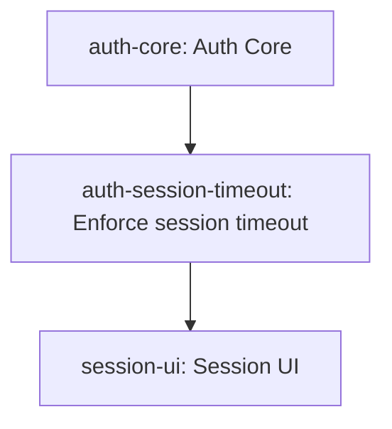

# Новая утилита скила `backlog-engineer`

Документ описывает базовую концепцию новой утилиты и её CLI UX.

Здесь сознательно не описываются:
- внутренние артефакты утилиты;
- формат хранения графа на диске;
- алгоритмы синхронизации на уровне реализации;
- сложная служебная логика старой утилиты;
- baseline, rebaseline, stale и related-механика.

Документ отвечает только на вопросы:
- какой процесс поддерживает утилита;
- как оператор и агент с ней взаимодействуют;
- какие команды нужны;
- каким должен быть входной интерфейс пакета;
- какие правила обязательно нужно перенести в `SKILL.md`.

**Цель**

Утилита нужна для одной основной задачи:
- собирать и поддерживать backlog проекта в виде графа атомарных задач на основе архитектуры, ADR, технических решений и других документов.

Оператор должен уметь:
- попросить агента создать backlog из архитектуры;
- попросить агента добавить в backlog новый модуль;
- попросить агента обновить backlog после изменения существующего модуля;
- получить понятный ответ:
  - какие задачи добавились;
  - какие изменились;
  - какие удалены;
  - какие уже реализованные задачи затронуты и требуют доработки.

**Принципы UX**

1. Оператор ставит задачу обычным языком.
2. Агент читает документы и работает с утилитой сам.
3. Утилита не пытается сама понимать prose-документы.
4. Основная сущность backlog-а это атомарная задача.
5. Граф строится из задач и их зависимостей.
6. Все служебные состояния должны быть понятны оператору без чтения исходников утилиты.
7. Исходные пакеты после регистрации не изменяются.
8. Текущее состояние backlog-а агент читает из утилиты, а не восстанавливает вручную по пакетам и патчам.
9. Там, где утилита возвращает технический `id`, рядом должен возвращаться и человекочитаемый `label`.
10. Один backlog = одна директория.
11. Все артефакты backlog-а живут внутри этой директории.
12. Команды по умолчанию работают относительно backlog-директории, а не по внешнему идентификатору backlog-а.
13. Read-команды могут прозрачно восстановить только служебное runtime-состояние, если оно отсутствует, повреждено или не совпадает с каноническими артефактами.
14. Такое восстановление не является `refresh`, не создаёт новые бизнес-изменения и нужно только для технической консистентности.

**Модель взаимодействия**

- Оператор пишет и редактирует архитектурные и другие проектные документы.
- Оператор ставит агенту задачи.
- Агент читает документы, создаёт исходные пакеты и патчи, вызывает CLI.
- Утилита обновляет backlog и возвращает понятный результат.

Прямой вызов утилиты оператором не предполагается.

Рабочая модель такая:
- оператор формулирует запрос;
- агент выбирает и вызывает нужные команды;
- агент интерпретирует ответы утилиты и возвращает оператору результат.

**Directory-root модель backlog-а**

- Один backlog живёт в одной отдельной директории.
- Внутри этой директории живут все артефакты backlog-а:
  - граф и служебное состояние утилиты;
  - `packets/`;
  - `patches/`;
  - папка с отчётными артефактами;
  - скрытый root-marker файл `.backlog.json`.
- После `init` агент работает из backlog-директории или её поддиректорий.
- Все команды, кроме `init`, по умолчанию ищут `.backlog.json` в текущей директории и вверх по дереву.
- Внешний идентификатор backlog-а не является частью пользовательского UX и не должен быть тем, что агент обязан помнить между вызовами.

Ниже примеры команд предполагают, что агент запускает их из backlog-директории или её поддиректорий.

**Карта процесса**

1. Создание backlog
   - `init`
   - `register-source`
   - `list-sources`
   - `template`
   - `packet`
2. Получение информации о backlog
   - `status`
   - `report`
   - `items`
   - `search`
   - `gaps`
   - `queue`
   - `attention`
3. Изменение backlog
   - `patch-item`
   - `remove-item`
   - `delete-backlog`
4. Сервисные действия
   - `refresh`
   - `template`

**Read-команды и hidden maintenance rebuild**

Команды чтения могут прозрачно восстановить только служебное runtime-состояние backlog-а, если оно отсутствует, повреждено или не совпадает с каноническими артефактами.

Жёсткие правила:
- это не `refresh`;
- это не создаёт новые бизнес-изменения;
- это не заменяет явные mutating-команды;
- это нужно только для технической консистентности чтения.

**Операторские юзкейзы и цепочки действий агента**

| Операторский юзкейс | Что хочет оператор | Каноническая цепочка действий агента |
|---|---|---|
| Создать backlog с нуля по архитектуре | Получить первый backlog-граф проекта | `init` -> `register-source` для всех исходных документов -> `template packet` -> подготовка пакета -> при рискованном или крупном изменении `packet --dry-run` -> `packet` -> `status` |
| Добавить в backlog новый модуль или источник | Дозагрузить в backlog новый участок системы | `list-sources` -> `register-source` для нового документа -> `template packet` -> подготовка пакета -> при рискованном или крупном изменении `packet --dry-run` -> `packet` -> при необходимости `items` или `attention` по затронутым задачам |
| Обновить backlog после изменения существующего модуля или источника | Синхронизировать backlog с изменившейся архитектурой | Если известен источник: `refresh --source-id ...` или `refresh --source-path ...`; если известна задача: `refresh --item-key ...`; иначе `refresh` -> `search` для поиска затронутых задач -> если появились новые задачи: `template packet` -> при рискованном или крупном изменении `packet --dry-run` -> `packet`; если нужно изменить существующие задачи: `template patch` -> при рискованном или крупном изменении `patch-item --dry-run` -> `patch-item`; если задачи устарели: `remove-item --dry-run` -> `remove-item` |
| Показать общее состояние backlog | Понять текущее состояние backlog в целом | `status`; если оператор просит именно актуальное состояние на сейчас: `status --refresh`; если нужен полноценный обзорный документ для оператора: `report` |
| Показать, что изменилось после последнего действия | Понять результат последнего обновления backlog | Использовать компактный ответ последней mutating-команды (`packet`, `patch-item`, `remove-item`, `refresh`); если нужны детали по конкретным задачам: `items` |
| Показать, что требует внимания | Найти задачи, которые надо проверить или пересмотреть | `attention` -> при необходимости `items` по выбранным задачам |
| Показать, что можно брать дальше | Найти следующий исполнимый фронт работы | `queue` -> при необходимости `items` по задачам из выбранной цепочки |
| Проверить один модуль, источник или конкретную задачу | Получить scoped-картину без обзора всего backlog | Если известен `item_key`: `items`; если известен источник: `refresh --source-id ...` или `refresh --source-path ...` -> `search --source-ids ...` -> при необходимости `items`; если ключи задач неизвестны: `search` -> `items` |

Эта матрица должна быть дублирована в `SKILL.md` в короткой форме.

**Scoped UX для вопроса “проверь один модуль/источник/задачу”**

Основной ответ агента должен быть компактным и всегда содержать:
- что именно было проверено: модуль, источник или `item_key`;
- какие задачи попали в scoped-выборку;
- какие задачи требуют ревью;
- какие задачи заблокированы;
- какие задачи можно брать дальше;
- какой следующий шаг логичен, если оператор попросит продолжение.

Жёсткие правила выбора команд:
- `search` достаточно, когда ключи задач ещё неизвестны и нужно только найти scoped-набор задач;
- `items` обязательно, когда `item_key` уже известен или когда агент собирается говорить о конкретных задачах поимённо;
- `attention` нужно отдельно, когда scoped-вопрос звучит как “что в этом модуле/источнике требует проверки”;
- `gaps` нужно отдельно, когда scoped-вопрос звучит как “что здесь блокирует движение” или когда нужен явный список блокировок по нескольким задачам.

Если оператор спрашивает про один модуль или источник, канонический путь такой:
- если известен источник, сначала `refresh --source-id ...` или `refresh --source-path ...`;
- затем `search` по scoped-фильтру;
- `items` только по отобранным задачам, если нужны конкретные карточки;
- `attention` отдельно только если нужно свернуть scoped-результат именно к задачам на ревью;
- `gaps` отдельно только если нужен список блокировок как самостоятельный ответ.

Если оператор спрашивает про одну конкретную задачу по `item_key`, канонический путь такой:
- сразу `items`;
- `attention` отдельно не нужен, если открытые `todo` уже видны в карточке;
- `gaps` отдельно не нужен, если блокировки уже понятны из карточки и оператор не просил отдельный список.

## Пакет

Пакет это входной документ агента для обновления backlog.

Пакет должен описывать:
- контекст, который нужен для понимания задач;
- сами задачи;
- связи между задачами через поля внутри задач.

Пакет не должен описывать:
- внутренние служебные артефакты утилиты;
- техническую реализацию storage;
- вычисляемые поля, которые утилита может посчитать сама;
- открытые `todo`, которые создаёт и поддерживает сама утилита.

После успешной регистрации пакет считается immutable.

Это означает:
- исходный пакет больше не редактируется;
- все дальнейшие изменения и удаления выполняются только через патчи;
- текущее состояние backlog-а читается только через команды утилиты.

Открытые `todo` не являются частью пакета.

Это служебные записи утилиты:
- создаются только во время `packet`, `patch-item`, `remove-item`, `refresh`;
- хранят только актуальные незакрытые действия;
- удаляются, когда соответствующее действие закрыто патчем.

**Структура пакета**

```json
{
  "context": {
    "glossary": [
      {
        "term": "<term_title>",
        "definition": "<term_definition>",
        "aliases": ["<term_alias>"]
      }
    ],
    "key_strategy": {},
    "target_system": [],
    "as_built": [],
    "claims": [],
    "contracts": [],
    "data_domains": [],
    "quality_attributes": [],
    "policy_decisions": []
  },
  "items": []
}
```

**Правила пакета**

1. `items` это главное содержимое пакета.
2. `context` это дополняющий контекст.
3. Пакет может быть:
   - полным, если агент создаёт backlog с нуля;
   - частичным, если агент добавляет новые задачи только для одного модуля или одного участка графа.
4. Жёсткое правило:
   - новые задачи добавляются только через `packet`;
   - изменение существующих задач выполняется только через patch;
   - удаление существующих задач выполняется только через patch.
5. Утилита не должна использовать `packet` для удаления задач.
6. Если задача больше не актуальна, её удаление делается только через патч и команду `remove-item`.
7. Контекстные сущности `claim`, `contract`, `data_domain`, `quality_attribute`, `policy_decision` неизменяемы по своему ключу.
8. Если сущность с тем же ключом уже существует, её нельзя переопределять новым смыслом.
9. Конфликтующее переопределение контекстной сущности = ошибка.
10. Если смысл контекстной сущности изменился, агент создаёт новую сущность с новым ключом и перепривязывает задачи патчем.

**Контекст пакета**

| Поле | Что это | Правило |
|---|---|---|
| `context.glossary` | Словарь терминов проекта | Один термин хранит название, определение и синонимы. Если одинаковый термин приходит с разными определениями, утилита не мержит пакет и падает с конфликтом, возвращая термин, оба определения, источники конфликта и требование явно разрешить конфликт. |
| `context.key_strategy` | Правила генерации ключей | Нужны для того, чтобы агент создавал предсказуемые, стабильные и понятные ключи. |
| `context.target_system` | Краткая выжимка из целевой архитектуры | Поле опционально. Используется как короткое машинно-читаемое резюме, чаще всего в стартовом или специальном пакете. Формат должен быть коротким и структурированным, а не большим Markdown-блоком. |
| `context.as_built` | Краткая выжимка из фактического текущего состояния | Поле опционально. Используется только там, где реально нужно для backlog-а. Формат тоже должен быть коротким и структурированным. |
| `context.claims` | Требования, утверждения, обязательства | Нужны, чтобы не терять требования из архитектуры и показывать, какая задача покрывает какое требование. |
| `context.contracts` | Интерфейсные и интеграционные контракты | Нужны, чтобы понимать, какие задачи затрагивают интерфейсы и интеграции. |
| `context.data_domains` | Зоны данных | Нужны, чтобы понимать, какие задачи затрагивают какие данные. |
| `context.quality_attributes` | Требования по качеству | Нужны для надёжности, производительности, безопасности, наблюдаемости и т.д. |
| `context.policy_decisions` | Проектные и организационные решения и ограничения | Нужны, чтобы не терять обязательные правила и ограничения. |

**Примеры элементов контекста**

```json
{
  "claim_key": "<claim_key>",
  "title": "<claim_title>",
  "claim_class": "<claim_class>",
  "commitment": "<claim_commitment>",
  "source_ids": ["<source_id>"]
}
```

```json
{
  "contract_key": "<contract_key>",
  "title": "<title>",
  "owner": "<owner>",
  "versioning_strategy": "<versioning_strategy>",
  "reconciliation_strategy": "<reconciliation_strategy>",
  "deprecation_window": "<deprecation_window>",
  "retirement_condition": "<retirement_condition>"
}
```

```json
{
  "data_domain_key": "<data_domain_key>",
  "title": "<title>",
  "data_class": "<data_class>",
  "owners": ["<owner>"]
}
```

```json
{
  "quality_attribute_key": "<quality_attribute_key>",
  "title": "<title>",
  "quality_class": "<quality_class>",
  "target": "<target>",
  "applies_to_item_keys": ["<item_key>"],
  "owner_keys": ["<owner_key>"],
  "source_ids": ["<source_id>"]
}
```

```json
{
  "policy_decision_key": "<policy_decision_key>",
  "title": "<title>",
  "policy_surface": "<policy_surface>",
  "decision_state": "<decision_state>",
  "owner": "<owner>",
  "source_ids": ["<source_id>"],
  "related_item_keys": ["<item_key>"]
}
```

**Атомарная задача**

`items` это атомарные задачи.

Атомарная задача:
- имеет одну понятную цель;
- имеет один внятный результат;
- может быть отдельно специфицирована;
- может быть отдельно спланирована;
- может быть отдельно реализована.

**Структура задачи**

```json
{
  "item_key": "<item_key>",
  "title": "<title>",
  "type": "<item_type>",
  "delivery_state": "<delivery_state>",
  "gaps": ["<gap_description>"],
  "depends_on_keys": ["<item_key>"],
  "origin_source_ids": ["<source_id>"],
  "specification_source_ids": ["<source_id>"],
  "plan_source_ids": ["<source_id>"],
  "implementation_source_ids": ["<source_id>"],
  "test_source_ids": ["<source_id>"],
  "claim_keys": ["<claim_key>"],
  "contract_keys": ["<contract_key>"],
  "data_domain_keys": ["<data_domain_key>"],
  "quality_attribute_keys": ["<quality_attribute_key>"],
  "policy_decision_keys": ["<policy_decision_key>"]
}
```

**Поля задачи**

| Поле | Что это | Правило |
|---|---|---|
| `item_key` | Стабильный ключ задачи | По нему утилита понимает, что задачу надо добавить или обновить. |
| `title` | Короткий смысл задачи | Человеческое название. |
| `type` | Тип задачи | Набор типов нужно стандартизовать отдельно. |
| `delivery_state` | Технологический статус задачи | Предварительный вариант: `defined`, `specified`, `planned`, `implemented`. |
| `gaps` | Список пробелов по задаче | Если массив непустой, задача не готова к следующему шагу. |
| `depends_on_keys` | Зависимости задачи | Список задач, без которых текущую задачу нельзя двигать дальше. |
| `origin_source_ids`, `specification_source_ids`, `plan_source_ids`, `implementation_source_ids`, `test_source_ids` | Связь с источниками | Хранят `source_id` зарегистрированных источников на разных этапах. |
| `claim_keys`, `contract_keys`, `data_domain_keys`, `quality_attribute_keys`, `policy_decision_keys` | Связь с контекстом | Хранят агентские ключи связанных элементов контекста. |

Отдельное поле `affects` в пакете не нужно.

Утилита должна вычислять его автоматически как обратную сторону `depends_on_keys`.

## init

**Назначение:** создать новую backlog-директорию и инициализировать в ней артефакты утилиты.

**Когда использовать:** когда backlog ещё не существует.

**Команда:**

```bash
./path/to/cli.mjs init --path "./backlog"
```

**Пример ответа:**

```json
{
  "path": "<normalized_path>/backlog",
  "root_marker_path": "<normalized_path>/backlog/.backlog.json",
  "agents_path": "<normalized_path>/backlog/AGENTS.md"
}
```

После `init` backlog определяется его директорией, а не внешним `id`.

`init` должен создавать внутри backlog-директории:
- скрытый root-marker `.backlog.json`;
- стандартный файл `AGENTS.md`;
- системные папки утилиты, включая `packets/`, `patches/` и папку отчётных артефактов.

Минимум в `AGENTS.md` должно быть зафиксировано:
- пакеты immutable после регистрации;
- новые задачи добавляются только через `packet`;
- изменения и удаление существующих задач выполняются только через patch;
- `search` использовать, когда ключи задач ещё неизвестны или нужен отбор;
- `items` использовать, когда ключи задач уже известны и нужны полные карточки;
- `refresh` использовать, когда есть риск, что документы-источники изменились;
- `queue` использовать, когда нужно понять, что можно брать дальше;
- `attention` использовать, когда нужно понять, что требует проверки или перепроверки.

**Инструкции скила для агента:**

- Вызывай `init` только если backlog ещё не зарегистрирован.
- Не создавай backlog вручную через файловые операции вместо `init`.
- После `init` переходи в backlog-директорию или вызывай дальнейшие команды из неё.
- Считай `AGENTS.md`, созданный через `init`, обязательным локальным reinforcement-артефактом для агента.

## register-source

**Назначение:** зарегистрировать документ-источник и получить его `source_id`.

**Когда использовать:** когда агент нашёл архитектурный, модульный, ADR или иной документ, который должен участвовать в построении backlog-а.

**Команда:**

```bash
./path/to/cli.mjs register-source \
  --path "../docs/architecture/system.md" \
  --kind "<source_type>" \
  --authority "<authority_type>" \
  --note "<readable_note>"
```

`kind`:
- тип источника;
- должен быть стандартизован в skill-е.

`authority`:
- тип доверия источнику;
- должен быть стандартизован в skill-е.

**Пример ответа:**

```json
{
  "source_id": "<uuid>",
  "source_label": "../docs/architecture/system.md",
  "path": "../docs/architecture/system.md",
  "kind": "<source_type>",
  "authority": "<authority_type>",
  "note": "<readable_note>",
  "hash": "<content_hash>"
}
```

Утилита:
- регистрирует источник;
- выдаёт ему стабильный `source_id`;
- сохраняет `hash`, чтобы позже можно было определить, изменился ли файл.
- не создаёт дубликат, если источник с тем же нормализованным путём уже зарегистрирован в текущем backlog-е; вместо этого возвращает существующую запись.

**Инструкции скила для агента:**

- Перед `register-source` сначала прочитай сам документ и только потом выбирай `kind` и `authority`.
- `--path` может указывать как на документ внутри backlog-директории, так и на документ снаружи неё.
- Утилита хранит путь источника как нормализованный POSIX-путь относительно backlog root; внешний источник может выглядеть как `../docs/...` или `../../...`.
- Если не уверен, что источник уже зарегистрирован, сначала вызови `list-sources`, а не регистрируй дубликат вслепую.
- После регистрации используй в пакетах и ответах утилиты именно `source_id`, а не пытайся повторно вычислять его по имени файла.

## list-sources

**Назначение:** получить список зарегистрированных источников.

**Когда использовать:** когда нужны актуальные `source_id` и человекочитаемые подписи источников.

**Команда:**

```bash
./path/to/cli.mjs list-sources
```

или только для конкретной задачи:

```bash
./path/to/cli.mjs list-sources --item-key "<item_key>"
```

или для детерминированного поиска источника по пути:

```bash
./path/to/cli.mjs list-sources --path "./architecture.md"
```

**Пример ответа:**

```json
[
  {
    "source_id": "<uuid>",
    "source_label": "docs/architecture/system.md",
    "path": "<normalized_path>/architecture.md",
    "kind": "<source_type>",
    "authority": "<authority_type>",
    "note": "<readable_note>",
    "hash": "<content_hash>"
  }
]
```

**Инструкции скила для агента:**

- Используй `list-sources`, когда нужны актуальные `source_id` и `source_label`.
- Не восстанавливай соответствие `source_id -> документ` по пакетам или патчам вручную.
- Если нужно найти источник по документу, используй `list-sources --path ...`, а не ручное сравнение полного списка.
- Если работаешь с конкретной задачей, сначала пробуй `list-sources --item-key ...`, а не общий список по всему backlog.

## packet

**Назначение:** зарегистрировать новый пакет и обновить backlog-граф.

**Когда использовать:** когда агент подготовил новый исходный пакет по текущим документам.

**Команда:**

```bash
./path/to/cli.mjs packet --path "./packets/auth.json"
```

Для preview без записи на диск:

```bash
./path/to/cli.mjs packet --path "./packets/auth.json" --dry-run
```

**Что делает утилита:**

1. Читает пакет.
2. Проверяет форму пакета.
3. Добавляет новые задачи.
4. Проверяет, что ни один `item_key` из пакета не совпадает с уже существующей задачей.
5. Если найдено совпадение по `item_key`, завершает команду с ошибкой и не меняет backlog.
6. Не удаляет существующие задачи через пакет.
7. Пересобирает граф на основе `depends_on_keys`.
8. Пересчитывает вычисляемые признаки внимания и список затронутых задач.
9. Возвращает понятную сводку изменений.

Если указан `--dry-run`, утилита должна:
- выполнить все проверки и пересчёты на временной копии состояния в памяти;
- вернуть тот же тип компактной сводки изменений;
- не записывать ничего на диск;
- не регистрировать пакет как применённый.

**Правила применения:**

- Если задача новая, утилита регистрирует её как новую вершину графа.
- Если задача уже существует, `packet` не должен использоваться для её изменения; команда должна завершаться ошибкой, а изменение должно выполняться через patch.
- Если новые задачи затрагивают уже существующий граф через зависимости или контекст, утилита пересчитывает `needs_attention` у связанных задач.
- Если у задачи есть `gaps`, она помечается как требующая внимания.
- Если изменился зарегистрированный источник, связанный с задачей, утилита помечает задачу как требующую внимания.
- Если изменился связанный контекст задачи, утилита помечает задачу как требующую внимания.

**Пример ответа:**

```json
{
  "counts": {
    "added": 1,
    "removed": 0,
    "todo_created": 1,
    "todo_updated": 0
  },
  "added": ["users-db"],
  "removed": [],
  "todo_created": ["auth-core"],
  "todo_updated": [],
  "dry_run": false,
  "next_commands": [
    {
      "command": "attention",
      "args": [],
      "reason": "После регистрации пакета появились новые открытые todo."
    },
    {
      "command": "items",
      "args": [
        "--item-keys",
        "auth-core,session-service"
      ],
      "reason": "Нужно прочитать полные карточки задач, для которых утилита создала или обновила todo."
    }
  ]
}
```

Где:
- `added`: новые задачи;
- `removed`: для `packet` всегда пустой список; поле сохраняется только для единообразия с другими mutating-командами;
- `todo_created`: задачи, для которых утилита создала новые действия;
- `todo_updated`: задачи, у которых существующие действия были обновлены;
- `dry_run`: признак preview-режима без записи на диск;
- `next_commands`: массив структурированных рекомендаций со схемой:
  - `command`
  - `args`
  - `reason`

Ответ mutating-команды должен оставаться компактным:
- без полных карточек задач;
- без полного diff по полям;
- только короткие списки `item_key`, счётчики и рекомендуемые следующие команды.

Если в пакете обнаружены уже существующие `item_key`, команда должна возвращать ошибку с перечислением конфликтующих ключей и не менять backlog.

Минимальный follow-up после mutating-команды должен быть жёстко определён:
- если `todo_created > 0` или `todo_updated > 0`, агент идёт в `attention` или `items` только по указанным в ответе ключам;
- если открытых `todo` в результате нет и оператор просил только результат изменения, дополнительных чтений не нужно.

После успешного `packet` исходный пакет считается immutable.

**Инструкции скила для агента:**

- Создавай пакет только по текущим документам и зарегистрированным `source_id`.
- Добавляй новые задачи только через `packet`.
- Не используй `packet` для изменения или удаления существующих задач.
- Если пакет большой, рискованный или может затронуть много задач, сначала используй `packet --dry-run`.
- После успешной регистрации пакета не считай файл пакета текущим состоянием backlog-а.
- Для чтения актуального состояния после `packet` используй только команды утилиты: `status`, `items`, `search`, `queue`, `attention`.
- `report` не является частью обычного agent flow после `packet`; используй его только если оператор явно просит отчётный документ.
- Если в ответе `packet` есть `todo_created` или `todo_updated`, переходи только к `attention` или `items` по указанным ключам.
- Если в ответе `packet` нет открытых `todo` и оператор просил только результат изменения, дополнительных чтений не делай.
- Это правило обязательно перенести в `SKILL.md`.

## status

**Назначение:** дать быструю сводку по backlog-у.

**Когда использовать:** когда нужен общий статус backlog-а без чтения отдельных задач и без генерации отдельного файла.

Жёсткое правило выбора:
- `status` = короткая сводка в диалоге;
- `report` = полный операторский документ на диск.

**Команда:**

```bash
./path/to/cli.mjs status
```

Если оператору нужна именно свежая сводка по состоянию backlog-а на текущий момент, утилита должна поддерживать явный вариант:

```bash
./path/to/cli.mjs status --refresh
```

`status --refresh` должен:
- сначала выполнить глобальный `refresh`;
- затем вернуть обычный `status` по уже обновлённому состоянию backlog-а.

Обычный `status` не должен выполнять скрытый auto-refresh.

При этом любая read-команда может прозрачно восстановить только служебное runtime-состояние, если оно отсутствует, повреждено или не совпадает с каноническими артефактами.

Такое восстановление:
- не является `refresh`;
- не создаёт новые бизнес-изменения;
- не заменяет явный `status --refresh`.

**Что должна возвращать команда:**

- общее количество задач;
- `last_refresh_at`;
- количество задач с `gaps`;
- количество задач в состоянии `specified`;
- количество задач в состоянии `planned`;
- количество задач в состоянии `implemented`;
- количество задач с `needs_attention = true`;
- количество задач с `ready_for_next_step = true`;
- количество задач с открытыми `todo`.

**Инструкции скила для агента:**

- Используй `status` для быстрой сводки по backlog-у и общей оценки состояния.
- Если оператор просит именно текущее состояние backlog-а на сейчас, используй `status --refresh`, а не обычный `status`.
- Если оператор говорит о конкретном изменившемся документе или модуле, сначала предпочитай scoped `refresh --source-id ...` или `refresh --source-path ...`, а не глобальный `status --refresh`.
- Не принимай решение о патчах только по `status`; для деталей используй `search`, `items`, `attention`.
- Когда оператор просит “что происходит с backlog-ом в целом”, начинай со `status`, а не с чтения отдельных задач.

## report

**Назначение:** создать человекочитаемый backlog в `md`-файле.

**Когда использовать:** когда оператору нужен полный обзорный документ backlog-а на диск.

Жёсткое правило выбора:
- `status` = короткая сводка в диалоге;
- `report` = полный операторский документ на диск.

**Команда:**

```bash
./path/to/cli.mjs report
```

Человекочитаемый backlog должен быть не просто дампом задач, а рабочим обзором backlog-а для оператора и агента.

`report` не должен принимать `--out`.

Путь генерации должен быть стандартным и предсказуемым, например внутри фиксированной папки backlog-артефактов.

**Минимальная структура `report.md`:**

1. Краткое описание системы
   - короткая выжимка о системе и её назначении;
   - если есть `target_system` и `as_built`, использовать их как основу;
   - если их нет, строить краткое описание по зарегистрированным источникам и задачам.
2. Ключевые метрики backlog-а
   - общее количество задач;
   - количество задач по `delivery_state`;
   - количество задач с `needs_attention = true`;
   - количество задач с `ready_for_next_step = true`;
   - количество задач с `gaps`.
3. Граф задач в виде `mermaid`
   - показывать зависимости между задачами;
   - использовать `item_key` как стабильные узлы графа;
   - рядом с ключом давать короткий читаемый label.
4. Список задач, требующих внимания
   - задачи с `needs_attention = true`;
   - по каждой задаче показывать `attention_reasons`.
5. Очередь задач для следующего шага
   - задачи с `ready_for_next_step = true`;
   - в порядке, удобном для дальнейшей работы.
6. Полный каталог задач
   - все задачи в человекочитаемом виде;
   - по каждой задаче показывать:
     - `item_key`
     - `title`
     - `type`
     - `delivery_state`
     - `needs_attention`
     - `ready_for_next_step`
     - `gaps`
     - `depends_on_keys`
     - обратные зависимости
     - связанные источники
     - связанные элементы контекста
     - короткие метрики задачи

Под короткими метриками задачи разумно понимать:
- количество зависимостей;
- количество обратных зависимостей;
- количество `gaps`;
- количество связанных источников;
- количество связанных элементов контекста.

Если backlog большой, одного общего `mermaid`-графа может быть недостаточно.

В этом случае утилита должна уметь:
- строить один общий компактный граф;
- дополнительно строить локальные графы по связанным подграфам, модулям или крупным участкам backlog-а.

**Пример верхней структуры `report.md`:**

````md
# Backlog Report

## System Summary

## Backlog Metrics

## Task Graph


## Needs Attention

## Ready For Next Step

## All Items
````

**Инструкции скила для агента:**

- Используй `report` только когда оператору нужен отчётный документ на диск.
- Не собирай операторский обзор вручную из нескольких команд, если можно отдать готовый `report`.
- Не используй `report` как часть обычного agent flow или как источник быстрых ответов в диалоге.

## items

**Назначение:** вернуть одну или несколько полных карточек задач.

**Когда использовать:** когда `item_key` уже известны и нужны все детали.

Жёсткое правило выбора:
- `search` = когда ключи задач ещё неизвестны или нужен отбор;
- `items` = когда ключи задач уже известны и нужны полные карточки.

**Команда:**

```bash
./path/to/cli.mjs items --item-keys "<item_key_1>,<item_key_2>"
```

Если агент запрашивает один ключ, утилита всё равно возвращает массив с одним элементом.

Если агент запрашивает несколько ключей, утилита возвращает массив карточек в одном ответе.

**Что должна возвращать команда по каждой задаче:**

- поля самой задачи;
- зависимости задачи (`depends_on_keys`);
- обратные зависимости, вычисленные утилитой;
- связанные источники;
- связанные элементы контекста (`claim`, `contract`, `data_domain`, `quality_attribute`, `policy_decision`);
- вычисляемое состояние задачи;
- открытые `todo` задачи.

Во всех полях ответа, где задача связана с источниками, утилита должна возвращать одновременно:
- `source_id`
- `source_label`

**Вычисляемое состояние задачи:**

- Жёсткий язык состояний:
  - `gaps` = блокировка;
  - открытые `todo` по `source_changed`, `dependency_changed`, `context_changed` = нужно ревью;
  - `ready_for_next_step = true` = можно брать дальше.
- `needs_attention`
  - вычисляемый признак утилиты;
  - показывает, требует ли задача внимания из-за открытых `todo` или незакрытых `gaps`.
- `attention_reason_codes`
  - стабильные короткие коды причин внимания;
  - должны возвращаться в том же порядке, что и человекочитаемые причины:
    1. `source_changed`
    2. `dependency_changed`
    3. `context_changed`
    4. `gaps`
- `attention_reasons`
  - короткие человекочитаемые причины;
  - пример: `"есть gaps"`, `"нужно проверить изменение источника auth.md"`, `"нужно проверить изменение зависимости auth-core"`.
  - причины `attention` не равны по срочности и должны группироваться так:
    - `source_changed`, `dependency_changed`, `context_changed` = нужно ревью;
    - `gaps` = явная блокировка.
  - в выдаче причины нужно показывать именно в этом порядке:
    1. изменения источника, зависимости, контекста;
    2. `gaps`.
- `ready_for_next_step`
  - вычисляемый признак утилиты;
  - показывает, можно ли брать задачу в следующий рабочий шаг без дополнительных действий.
  - задача не готова к следующему шагу, если у неё есть открытые `todo`, незакрытые `gaps` или блокирующие зависимости.
  - зависимость считается неблокирующей только если она находится как минимум на стадии, достаточной для следующего шага текущей задачи.
  - это правило должно быть детерминированным и одинаковым во всех командах утилиты.

Если задаче нужно внимание, причин может быть несколько одновременно. Поэтому один строковый статус здесь плохая модель.

**`todo` в ответе `items`:**

`todo` не является полем пакета.

Это служебные данные, которые ведёт сама утилита. В `items` открытые `todo` нужны, чтобы быстро понять:
- какие действия по задаче сейчас ожидаются;
- что именно стало причиной этих действий;
- какие связанные задачи или источники нужно проверить.

`todo` хранит только открытые действия.

Поле `managed_by` тоже служебное:
- `refresh` — такие `todo` утилита может снять автоматически при следующем `refresh`, если наблюдаемая причина исчезла;
- `mutation` — такие `todo` появились из `packet` / `patch-item` / `remove-item` и не должны сниматься обычным `refresh`.

Закрытые `todo` в графе не хранятся и не архивируются.

**Пример ответа `items`:**

```json
[
  {
    "item": {
      "item_key": "auth-session-timeout",
      "title": "Enforce session timeout",
      "type": "feature",
      "delivery_state": "defined",
      "gaps": [],
      "depends_on_keys": ["auth-core"],
      "origin_source_ids": ["<source_id>"],
      "claim_keys": ["auth-session-timeout-claim"]
    },
    "reverse_dependency_keys": ["session-ui"],
    "source_summaries": [
      {
        "source_id": "<source_id>",
        "source_label": "docs/modules/auth.md"
      }
    ],
    "context": {
      "claim_keys": ["auth-session-timeout-claim"],
      "contract_keys": [],
      "data_domain_keys": [],
      "quality_attribute_keys": [],
      "policy_decision_keys": []
    },
    "computed_state": {
      "needs_attention": true,
      "ready_for_next_step": false,
      "attention_reason_codes": [
        "dependency_changed"
      ],
      "attention_reasons": [
        "нужно проверить изменение зависимости auth-core"
      ]
    },
    "todo": [
      {
        "todo_id": "<todo_id>",
        "type": "review_dependency_change",
        "managed_by": "mutation",
        "message": "Родительская задача auth-core изменилась. Проверь, нужны ли изменения для этой задачи.",
        "created_at": "2026-04-02T08:30:00Z",
        "related_item_keys": ["auth-core"],
        "related_sources": [
          {
            "source_id": "<source_id>",
            "source_label": "docs/modules/auth.md"
          }
        ]
      }
    ]
  }
]
```

**Инструкции скила для агента:**

- Используй `items`, когда ключи задач уже известны и нужны полные карточки.
- Не запрашивай длинные списки “на всякий случай”; сначала сузь кандидатов через `search`.
- Если у задачи `needs_attention = true`, перед патчем обязательно прочитай `attention_reasons` и открытые `todo`.

## search

**Назначение:** найти задачи по условиям, когда их ключи ещё неизвестны.

**Когда использовать:** когда нужно собрать кандидатов по фильтрам, а не читать уже известные задачи.

Жёсткое правило выбора:
- `search` = когда ключи задач ещё неизвестны или нужен отбор;
- `items` = когда ключи задач уже известны и нужны полные карточки.

**Команда:**

```bash
./path/to/cli.mjs search \
  --source-ids "<source_id_1>,<source_id_2>" \
  --delivery-state "implemented" \
  --needs-attention true
```

**Минимальные поддерживаемые фильтры:**

- `--source-ids`
- `--delivery-state`
- `--needs-attention`
- `--ready-for-next-step`
- `--claim-keys`
- `--contract-keys`
- `--data-domain-keys`
- `--quality-attribute-keys`
- `--policy-decision-keys`

`search` должен поддерживать комбинируемые фильтры.

Результат `search` должен быть компактнее, чем у `items`.

**По умолчанию `search` должен возвращать:**

- `item_key`
- `title`
- `type`
- `delivery_state`
- `needs_attention`
- `ready_for_next_step`
- `attention_reason_codes`
- `attention_reasons`
- `source_summaries`
- `match_reasons`

`source_summaries` должны возвращаться в компактном виде:
- `source_id`
- `source_label`

`match_reasons` должны коротко объяснять, почему задача попала в выборку.

Если агенту нужна полная карточка задачи, он после `search` вызывает `items`.

**Пример ответа `search`:**

```json
[
  {
    "item_key": "auth-core",
    "title": "Auth Core",
    "type": "feature",
    "delivery_state": "implemented",
    "needs_attention": true,
    "ready_for_next_step": false,
    "attention_reason_codes": [
      "dependency_changed"
    ],
    "attention_reasons": [
      "изменилась зависимая задача session-timeout"
    ],
    "source_summaries": [
      {
        "source_id": "<source_id>",
        "source_label": "docs/modules/auth.md"
      }
    ],
    "match_reasons": [
      "delivery_state=implemented",
      "needs_attention=true"
    ]
  }
]
```

**Инструкции скила для агента:**

- Используй `search`, когда ещё не знаешь `item_key` или когда нужен список кандидатов по условиям.
- Старайся собрать нужные фильтры в один вызов `search`, а не делать цепочку мелких запросов.
- После `search` запрашивай через `items` только отобранные задачи, для которых действительно нужны детали.

## gaps

**Назначение:** вернуть незакрытые пробелы по backlog-у или по конкретной задаче.

**Когда использовать:** когда нужны именно `gaps`, а не общий статус внимания.

**Команда:**

```bash
./path/to/cli.mjs gaps
```

или для одной задачи:

```bash
./path/to/cli.mjs gaps --item-key "<item_key>"
```

**Инструкции скила для агента:**

- Используй `gaps`, когда нужно явно увидеть незакрытые пробелы, а не только общее `needs_attention`.
- Для одной задачи сначала можно вызвать `items`, но если нужны именно gaps как отдельный список, используй `gaps`.
- Не пытайся выводить gaps косвенно из других полей, если утилита умеет вернуть их напрямую.

## queue

**Назначение:** вернуть задачи, которые можно брать в следующий рабочий шаг.

**Когда использовать:** когда оператор спрашивает “что делать дальше”.

**Команда:**

```bash
./path/to/cli.mjs queue
```

**Команда должна возвращать задачи, у которых:**

- `ready_for_next_step = true`;
- задача ещё не реализована;
- нет незакрытых зависимостей;
- нет `gaps`.

`queue` должен возвращать не плоский список, а список цепочек.

Правило такое:
- одна корневая ветка графа = одна цепочка;
- в цепочку попадают только задачи, которые соответствуют правилам выше;
- если в графе несколько корневых веток, результат `queue` должен содержать несколько цепочек.

Порядок задач внутри цепочки должен быть явным и стабильным:
- сначала по глубине в цепочке;
- затем по числу downstream-зависимостей;
- затем по `item_key` как tie-breaker.

Минимальная форма ответа:

```json
[
  {
    "root_item_key": "auth-core",
    "items": [
      "auth-core",
      "auth-session-timeout",
      "session-ui"
    ],
    "ordering_rule": [
      "depth",
      "downstream_dependency_count",
      "item_key"
    ]
  }
]
```

**Инструкции скила для агента:**

- Используй `queue`, когда оператор спрашивает “что делать дальше”.
- Не пытайся собирать очередь вручную из `search` и `items`, если утилита уже вычисляет `ready_for_next_step`.
- После `queue` используй `items` только для задач, которые реально планируешь разбирать дальше.

## attention

**Назначение:** вернуть задачи, которые требуют проверки или перепроверки.

**Когда использовать:** когда нужно понять, что сейчас проблемное или требует внимания.

**Команда:**

```bash
./path/to/cli.mjs attention
```

**Команда должна возвращать:**

- `item_key`
- `title`
- `attention_reason_codes`
- `attention_reasons`
- при необходимости короткие `source_summaries`

Причины `attention` должны возвращаться в фиксированном порядке:
1. `source_changed`
2. `dependency_changed`
3. `context_changed`
4. `gaps`

Первые три причины означают, что задачу нужно пересмотреть.

`gaps` означает явную блокировку дальнейшего движения.

**Инструкции скила для агента:**

- Используй `attention` после `refresh`, после применения патчей и в ситуациях, когда нужно понять, что требует перепроверки.
- Не интерпретируй `needs_attention` без причины; если задача важна, после `attention` открой её через `items`.
- Если оператор спрашивает, “что сейчас проблемное”, начинай с `attention`.

## patch-item

**Назначение:** применить patch-файл к одной или нескольким существующим задачам.

**Когда использовать:** когда одна или несколько существующих задач изменились, но не удаляются.

**Патчи**

Исходные пакеты после регистрации не изменяются.

Все изменения после этого выполняются только через патчи.

Текущее состояние backlog-а определяется так:
- зарегистрированные исходные пакеты;
- применённые патчи;
- порядок применения патчей.

Порядок применения патчей критичен.

Поэтому:
- имя файла патча может содержать дату или номер для человека;
- канонический порядок утилита должна определять по метаданным самого патча.

Минимальные metadata патча:

```json
{
  "patch_id": "<patch_id>",
  "created_at": "<timestamp>",
  "sequence": "<sequence>",
  "target_item_keys": ["<item_key>"],
  "operations": []
}
```

**Команда:**

```bash
./path/to/cli.mjs patch-item \
  --patch "./patches/2026-04-02-001-auth-core.json"
```

Для preview без записи на диск:

```bash
./path/to/cli.mjs patch-item \
  --patch "./patches/2026-04-02-001-auth-core.json" \
  --dry-run
```

**Команда должна:**

- зарегистрировать патч;
- проверить `target_item_keys` в metadata патча;
- применить его ко всем задачам из `target_item_keys`;
- пересобрать затронутую часть графа;
- пересчитать `needs_attention` у затронутых задач;
- создать, обновить или удалить открытые `todo` у затронутых задач;
- вернуть понятную сводку изменений.

Если указан `--dry-run`, утилита должна:
- выполнить применение патча и все пересчёты на временной копии состояния в памяти;
- вернуть тот же тип компактной сводки изменений;
- не записывать ничего на диск;
- не регистрировать патч как применённый.

Патч изменяет текущее состояние через утилиту, но не переписывает исходный пакет на диске.

Ответ `patch-item` должен быть компактным и содержать:
- `counts`;
- `updated`;
- `todo_created`;
- `todo_updated`;
- `todo_removed`;
- `dry_run`;
- `next_commands`.

`next_commands` должны возвращаться не строками, а структурированными объектами:
- `command`
- `args`
- `reason`

Один patch-файл может содержать операции для нескольких `item_key`.

Если патч меняет несколько задач, ответ должен возвращать агрегированную сводку по всем затронутым `item_key`.

Патч может:
- менять поля задач;
- создавать новые открытые `todo`;
- обновлять существующие открытые `todo`;
- удалять закрытые `todo`.

**Инструкции скила для агента:**

- Перед `patch-item` сначала прочитай актуальное состояние через `search` и `items`, а не через файлы пакетов.
- Предпочитай готовить патч через `template patch`, а не писать его с нуля.
- Используй patch только для изменения существующих задач, а не для добавления новых.
- Если patch рискованный, массовый или оператор просит сначала показать эффект, используй `patch-item --dry-run`.
- Если patch-файл затрагивает много задач, отдельно предупреди оператора перед применением.
- Если в ответе `patch-item` есть `todo_created` или `todo_updated`, переходи только к `attention` или `items` по указанным ключам.
- Если в ответе `patch-item` нет открытых `todo` и оператор просил только результат изменения, дополнительных чтений не делай.

## remove-item

**Назначение:** удалить задачу через patch-файл удаления.

**Когда использовать:** когда задача действительно больше не нужна.

Команда `remove-item` удаляет одну или несколько целевых задач, указанных в metadata patch-файла удаления.

**Команда:**

```bash
./path/to/cli.mjs remove-item \
  --patch "./patches/2026-04-02-002-remove-legacy-auth.json"
```

Для preview без записи на диск:

```bash
./path/to/cli.mjs remove-item \
  --patch "./patches/2026-04-02-002-remove-legacy-auth.json" \
  --dry-run
```

**После удаления утилита:**

- проверяет `target_item_keys` в metadata патча;
- удаляет задачи из графа;
- обновляет зависимые задачи;
- пересчитывает их `needs_attention`;
- создаёт, обновляет или удаляет открытые `todo` у затронутых задач.

Если указан `--dry-run`, утилита должна:
- выполнить удаление и все пересчёты на временной копии состояния в памяти;
- вернуть тот же тип компактной сводки изменений;
- не записывать ничего на диск;
- не регистрировать patch-файл удаления как применённый.

`remove-item` тоже должен работать как регистрация и применение патча, а не как прямое редактирование исходного пакета.

Ответ `remove-item` должен быть компактным и содержать:
- `counts`;
- `removed`;
- `todo_created`;
- `todo_updated`;
- `todo_removed`;
- `dry_run`;
- `next_commands`.

`next_commands` должны возвращаться не строками, а структурированными объектами:
- `command`
- `args`
- `reason`

Один patch-файл удаления может содержать операции для нескольких `item_key`.

Если patch-файл удаления затрагивает несколько задач, ответ должен возвращать агрегированную сводку по всем удалённым и затронутым `item_key`.

**Инструкции скила для агента:**

- Используй `remove-item` только если задача действительно больше не нужна, а не просто изменилась.
- Используй patch для удаления существующих задач; не пытайся удалять их через `packet`.
- Если удаление рискованное, массовое или оператор просит сначала показать эффект, используй `remove-item --dry-run`.
- Если patch-файл удаления затрагивает много задач, отдельно предупреди оператора перед применением.
- Перед удалением проверь через `items` обратные зависимости и открытые `todo` задачи.
- Если в ответе `remove-item` есть `todo_created` или `todo_updated`, переходи только к `attention` или `items` по указанным ключам.
- Если в ответе `remove-item` нет открытых `todo` и оператор просил только результат удаления, дополнительных чтений не делай.

## delete-backlog

**Назначение:** удалить backlog-артефакты утилиты из backlog root.

**Когда использовать:** только по прямому запросу оператора.

**Команда:**

```bash
./path/to/cli.mjs delete-backlog
```

Это опасная команда. Агент должен:
- предупреждать оператора о последствиях;
- вызывать её только после явного подтверждения.

Команда удаляет только штатные backlog-артефакты:
- `.backlog.json`
- `AGENTS.md`
- `.backlog/`
- `packets/`
- `patches/`
- `reports/`

Если в backlog root есть посторонние файлы или директории, команда должна завершаться ошибкой и ничего не удалять.

**Инструкции скила для агента:**

- Вызывай `delete-backlog` только по прямому запросу оператора.
- Перед вызовом явно предупреди об удалении backlog-а и его артефактов.
- Не используй `delete-backlog` как способ “починить” состояние, если оператор этого не просил.

## refresh

**Назначение:** пересчитать `hash` зарегистрированных источников и обновить вычисляемое состояние затронутых задач.

**Когда использовать:** когда есть риск, что документы-источники изменились после регистрации.

**Команда:**

```bash
./path/to/cli.mjs refresh
```

Если команда вызвана без дополнительных параметров, утилита должна:
- пересчитать `hash` всех зарегистрированных источников backlog-а;
- найти все затронутые задачи;
- пересчитать у них `needs_attention`.

Если задана задача:

```bash
./path/to/cli.mjs refresh --item-key "<item_key>"
```

Тогда `refresh` должен:
- пересчитать `hash` всех источников, связанных с этой задачей;
- пересчитать `hash` всех источников задач в её зависимом подграфе;
- пересчитать `needs_attention` у самой задачи и у затронутых задач в этом подграфе.

Если известен источник, `refresh` должен поддерживать scoped-варианты:

```bash
./path/to/cli.mjs refresh --source-id "<source_id>"
```

```bash
./path/to/cli.mjs refresh --source-label "docs/modules/auth.md"
```

```bash
./path/to/cli.mjs refresh --source-path "./docs/modules/auth.md"
```

В этих вариантах `refresh` должен:
- найти все задачи, связанные с указанным источником;
- среди найденных задач определить верхние задачи этой source-ветки, то есть задачи без входящих зависимостей внутри scoped-набора;
- пересчитать `hash` самого источника;
- пересчитать `hash` источников задач в зависимом подграфе от найденных верхних задач;
- пересчитать `needs_attention` у задач этой ветки;
- создать, обновить или удалить открытые `todo` в этой ветке по результату refresh.

Если утилита обнаруживает, что `hash` источника изменился, она должна:
- найти связанные задачи;
- пересчитать у них `needs_attention`;
- создать или обновить открытые `todo` у затронутых задач.

Ответ `refresh` должен быть компактным и содержать:
- `counts`;
- `changed_sources`;
- `todo_created`;
- `todo_updated`;
- `todo_removed`;
- `next_commands`.

`next_commands` должны возвращаться не строками, а структурированными объектами:
- `command`
- `args`
- `reason`

**Пример записи в `todo`:**

```json
{
  "todo_id": "<todo_id>",
  "type": "review_source_change",
  "managed_by": "refresh",
  "message": "Источник docs/modules/auth.md изменился. Проверь, влияет ли это на задачу.",
  "created_at": "2026-04-01T10:15:00Z",
  "related_sources": [
    {
      "source_id": "<source_id>",
      "source_label": "docs/modules/auth.md"
    }
  ]
}
```

**Инструкции скила для агента:**

- Используй `refresh`, когда есть риск, что документы-источники изменились после регистрации.
- Если оператор говорит об изменившемся документе или модуле, предпочитай `refresh --source-id ...` или `refresh --source-path ...`, а не глобальный `refresh`.
- Используй `refresh --source-label ...` только если в текущем контексте это самый надёжный идентификатор источника.
- Если источник уже известен, не делай предварительный `search` только ради того, чтобы потом выполнить refresh по задаче; сначала попробуй scoped `refresh` по источнику.
- Если в ответе `refresh` есть `todo_created` или `todo_updated`, переходи только к `attention` или `items` по указанным ключам.
- Если в ответе `refresh` нет открытых `todo` и оператор просил только результат обновления, дополнительных чтений не делай.
- Если оператор просит обновить backlog после изменения модуля, `refresh` должен быть одним из первых шагов.

## template

**Назначение:** сгенерировать заготовки документов, чтобы агент не собирал их с нуля вручную.

**Когда использовать:** когда создаётся новый пакет или патч.

Команда должна поддерживать два режима:
- шаблон пустого пакета;
- шаблон пустого патча с частично предзаполненными полями.

**Шаблон пакета**

```bash
./path/to/cli.mjs template packet \
  --out "./packets/new-module.json"
```

Результат:
- пустой пакет в каноническом формате;
- с готовой структурой `context` и `items`;
- без служебных вычисляемых полей.

**Шаблон патча**

```bash
./path/to/cli.mjs template patch \
  --item-keys "<item_key_1>,<item_key_2>" \
  --out "./patches"
```

Результат:
- один пустой patch-файл с возможностью описать операции для нескольких целевых задач;
- с частично предзаполненными полями;
- в каждом файле как минимум с:
  - `patch_id`
  - `created_at`
  - `sequence`
  - `target_item_keys`
  - `operations`

Команда должна помогать агенту создать корректный каркас патча, но не должна применять его автоматически.

**Инструкции скила для агента:**

- Используй `template`, когда создаёшь новый пакет или патч, вместо ручного авторинга с нуля.
- Для patch workflow сначала найди нужные задачи через `search`, потом сгенерируй каркас через `template patch`.
- Не применяй сгенерированный шаблон без проверки и заполнения содержимого.

## Что важно сохранить в новой утилите

- простой операторский UX;
- атомарные задачи как главная единица backlog-а;
- граф зависимостей между задачами;
- явная связь задач с источниками и требованиями;
- понятная сводка изменений после применения пакета.

## Что важно не тащить из старой утилиты

- сложную служебную модель, которую оператор не сможет контролировать;
- скрытые статусы, смысл которых понятен только по исходному коду;
- дублирование одних и тех же связей в нескольких местах;
- поля, которые обязан поддерживать агент, хотя их может вычислить утилита.

## Открытые вопросы

На текущий момент зафиксированных открытых вопросов по этому документу нет.
