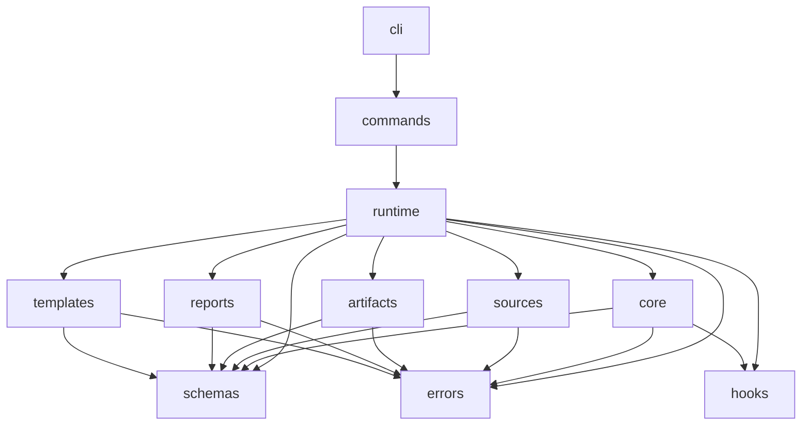

# Спецификация утилиты `@kostysh/backlog-engineer-cli`

## 1. Назначение и scope

Утилита нужна для одной основной задачи:

- собирать и поддерживать backlog проекта в виде графа атомарных задач на основе архитектуры, ADR, технических решений и других документов.

Утилита должна поддерживать полный рабочий цикл backlog sync:

- создание backlog-директории;
- регистрацию источников;
- импорт новых задач через immutable packets;
- изменение и удаление существующих задач через immutable patches;
- refresh по изменившимся источникам;
- чтение текущего состояния backlog через краткие и подробные read-команды;
- генерацию человекочитаемого отчёта;
- генерацию шаблонов packet и patch.

Спецификация не является поэтапной. Scope документа:

- полноценная система без выделения "v1 потом доделаем";
- вся функциональность, описанная в `process-cli.ru.md`;
- полная готовность к проектированию модулей, тестов и артефактов.

## 2. Non-goals

Утилита сознательно не делает:

- автоматическое понимание prose-документов;
- proof/review/governance слой;
- baseline, rebaseline, stale;
- скрытое фоновое наблюдение проекта;
- ручное редактирование канонического графа;

## 3. Архитектурные принципы

1. CLI-слой должен быть тонким.
2. Вся бизнес-логика графа должна жить вне `cli` и вне `commands`.
3. Каноническое состояние backlog-а принадлежит утилите.
4. Packet и patch после применения считаются immutable.
5. Utility-owned `todo` создаются только утилитой и хранят только открытые действия.
6. Все внешние входы валидируются через `zod@v4`.
7. Все ошибки должны иметь стабильный код, понятное сообщение и структурированные детали.
8. Все успешные ответы команд должны быть JSON.
9. `stdout` используется для успешного результата, `stderr` — для ошибок и диагностик.
10. Все операции должны быть детерминированными при одинаковом состоянии backlog-а и одинаковом наборе входов.
11. Команды чтения не должны выполнять semantic mutation backlog-а, но могут делать hidden maintenance write только для восстановления `state.json` по rules из `Recovery and rebuild contract`.
12. Система должна быть удобна для unit tests и не завязываться на реальные файловую систему, часы и генератор UUID.

## 4. Runtime contract

### 4.1. Directory-root модель

Один backlog живёт в одной отдельной директории.

Все артефакты backlog-а живут внутри этой директории:

- root-marker `.backlog.json`;
- `AGENTS.md`;
- `packets/`;
- `patches/`;
- `reports/`;
- скрытая директория внутренних артефактов `.backlog/`.

Команды, кроме `init`, должны:

- искать `.backlog.json` в текущей директории;
- если не нашли, идти вверх по дереву;
- использовать ближайший найденный backlog root.

Внешний `backlog_id` не является частью пользовательского UX.

### 4.2. Стандартный layout backlog-директории

```text
<backlog-root>/
├── .backlog.json
├── AGENTS.md
├── packets/
├── patches/
├── reports/
└── .backlog/
    ├── state.json
    ├── sources.json
    └── applied.json
```

### 4.3. Формат вывода и exit codes

#### Успех

- JSON в `stdout`
- exit code `0`

#### Ошибка

- JSON-объект ошибки в `stderr`
- ненулевой exit code

#### Рекомендуемая карта exit codes

| Exit code | Класс ошибки | Примеры |
| --- | --- | --- |
| `0` | success | команда выполнена |
| `1` | internal error | непойманное исключение, ошибка сериализации, повреждённое внутреннее состояние |
| `2` | usage error | неверный набор флагов, несовместимые аргументы, отсутствует обязательный аргумент |
| `3` | schema validation error | невалидный JSON, невалидный packet, невалидный patch |
| `4` | semantic/state conflict | `item_key` уже существует, конфликт glossary, sequence не монотонен |
| `5` | not found | backlog root не найден, item/source не найден |
| `6` | destructive action blocked | `delete-backlog` без подтверждения, запрещённая destructive-операция |

### 4.4. Стандартный error payload

```json
{
  "error": {
    "code": "BE_PACKET_ITEM_ALREADY_EXISTS",
    "message": "Packet contains item_key that already exists in the backlog.",
    "details": {
      "item_key": "auth-core",
      "packet_path": "packets/auth.json"
    },
    "hint": "Use patch-item to change an existing task."
  }
}
```

Требования:

- `code` стабилен и предназначен для машинной идентификации;
- `message` короткий и понятный человеку;
- `details` содержит только факты;
- `hint` объясняет следующий правильный шаг;
- тексты не должны быть двусмысленными.

## 5. Модульная архитектура

## 5.1. Верхнеуровневые модули

| Модуль | Ответственность | Зависит от | Не должен делать |
| --- | --- | --- | --- |
| `cli` | argv, help, dispatch, stdout/stderr, exit codes | `commands`, `errors` | бизнес-логику графа |
| `commands` | адаптеры отдельных команд | `runtime`, `errors`, `schemas` | прямой I/O артефактов и вычисления графа |
| `runtime` | сборка зависимостей, discovery backlog root, hook registry | `artifacts`, `core`, `sources`, `templates`, `reports`, `schemas`, `errors`, `hooks` | содержательную логику команд |
| `core` | каноническая логика графа, derived state, mutation/query services | `schemas`, `errors`, `hooks` | argv parsing, stdout/stderr |
| `sources` | регистрация источников, нормализация путей, hashing, source-scoped refresh | `schemas`, `errors` | изменение задач вне `core` |
| `artifacts` | создание layout, чтение/запись `state.json`, `sources.json`, `applied.json`, импорт packet/patch файлов, удаление backlog | `schemas`, `errors` | бизнес-решения о графе |
| `templates` | генерация `AGENTS.md`, packet template, patch template | `schemas`, `errors` | применение изменений |
| `reports` | сборка `report.md`, Mermaid-графа и операторских секций | `schemas`, `errors` | mutation состояния |
| `schemas` | все `zod@v4` схемы | none | I/O, побочные эффекты |
| `errors` | taxonomy ошибок, фабрики ошибок, exit-code mapping | none | файловые операции |
| `hooks` | интерфейсы расширения и no-op реализация | `schemas`, `errors` | владение каноническим состоянием |

## 5.2. Внутренние доменные сервисы `core`

`core` должен быть разбит минимум на такие сервисы:

- `graph-service`
  - добавление и удаление вершин;
  - построение прямых и обратных зависимостей;
  - проверка целостности ссылок;
- `context-service`
  - merge `glossary`, `claims`, `contracts`, `data_domains`, `quality_attributes`, `policy_decisions`;
  - детект конфликтов;
- `todo-service`
  - создание, обновление и удаление open `todo`;
  - дедупликация служебных `todo`;
- `derived-state-service`
  - расчёт `needs_attention`;
  - расчёт `attention_reasons`;
  - расчёт `ready_for_next_step`;
- `search-service`
  - фильтрация задач;
  - выдача компактных summaries;
- `items-service`
  - сборка полных карточек задач;
- `queue-service`
  - построение цепочек следующего шага;
- `attention-service`
  - выдача задач на ревью;
- `mutation-service`
  - orchestration для `packet`, `patch-item`, `remove-item`, `refresh`.

## 5.3. Модуль `hooks`

Hooks нужны для вызова внешних модулей без размывания `core`.

Hooks не должны:

- менять каноническое состояние backlog-а напрямую;
- обходить правила валидации;
- менять порядок применения packet/patch;
- подменять derived-state правила.

Минимальные hook points:

- `beforeCommand(commandName, input)`
- `afterCommand(commandName, output)`
- `afterSourceRegistered(sourceRecord)`
- `afterPacketApplied(summary, stateSnapshot)`
- `afterPatchApplied(summary, stateSnapshot)`
- `afterRefresh(summary, stateSnapshot)`
- `buildSystemSummary(context, items)` для `report`
- `decorateReportSections(sections)` для `report`

Все hooks должны быть опциональными. Базовая реализация — no-op.

## 5.4. Dependency direction

Допустимое направление зависимостей:



Обратные зависимости запрещены.

## 6. Артефакты утилиты

## 6.1. Root marker `.backlog.json`

Назначение:

- признак backlog root;
- минимальная metadata layout-а;
- версия схемы артефактов.

Рекомендуемая форма:

```json
{
  "schema_version": 1,
  "tool_name": "@kostysh/backlog-engineer-cli",
  "created_at": "2026-04-03T12:00:00Z",
  "layout_version": 1
}
```

## 6.2. Source registry `.backlog/sources.json`

Это канонический реестр зарегистрированных источников.

Его задача:

- хранить stable source identifier;
- хранить текущий принятый `hash`;
- делать `refresh` и `list-sources` независимыми от packet/patch файлов;
- быть частью recoverable artifact set.

Рекомендуемая форма:

```json
{
  "schema_version": 1,
  "created_at": "2026-04-03T12:00:00Z",
  "updated_at": "2026-04-03T12:15:00Z",
  "sources": []
}
```

### `sources[]`

Во внешнем контракте утилиты и во внутренних артефактах source record использует top-level поле `source_id`.

Связанные объекты и массивы в остальной модели также используют:

- `source_id` внутри embedded objects;
- `source_ids` внутри arrays.

```json
{
  "source_id": "<uuid>",
  "source_label": "sources/docs/modules/auth.md",
  "path": "sources/docs/modules/auth.md",
  "kind": "module",
  "authority": "authoritative",
  "note": "Auth module architecture",
  "hash": "<sha256>",
  "registered_at": "2026-04-03T12:01:00Z",
  "last_checked_at": "2026-04-03T12:15:00Z"
}
```

Правила:

- `path` хранится в нормализованном виде, относительно backlog root;
- `source_label` пригоден для чтения человеком;
- `source_label` должен быть детерминированным и уникальным внутри backlog-а; базовое правило: normalised relative path with POSIX separators;
- `hash` обновляется только через `refresh` или первичную регистрацию;
- повторный `register-source` по тому же пути возвращает существующую запись без скрытого обновления hash.

## 6.3. Applied artifact registry `.backlog/applied.json`

Это канонический журнал применения immutable packet и patch файлов.

Его задача:

- хранить порядок применения;
- хранить canonical path импортированных artifacts;
- делать rebuild детерминированным даже при отсутствии `state.json`.

Рекомендуемая форма:

```json
{
  "schema_version": 1,
  "created_at": "2026-04-03T12:00:00Z",
  "updated_at": "2026-04-03T12:30:00Z",
  "next_apply_index": 4,
  "packets": [],
  "patches": []
}
```

### `packets[]`

```json
{
  "packet_id": "<uuid>",
  "apply_index": 1,
  "canonical_path": "packets/3b7a19f5c3d1--auth-module.json",
  "content_hash": "<sha256>",
  "applied_at": "2026-04-03T12:10:00Z",
  "item_keys": ["auth-core", "auth-session-timeout"]
}
```

### `patches[]`

```json
{
  "patch_id": "2026-04-03-001-auth-core",
  "apply_index": 2,
  "canonical_path": "patches/f43b1d900a76--2026-04-03-001-auth-core.json",
  "content_hash": "<sha256>",
  "sequence": 1,
  "applied_at": "2026-04-03T12:30:00Z",
  "kind": "patch-item",
  "target_item_keys": ["auth-core"]
}
```

Правила:

- `apply_index` монотонен для всех реально применённых artifacts;
- rebuild использует `apply_index`, а не filesystem order;
- `sequence` остаётся авторским ordering field только для patch;
- packet ordering восстанавливается по `apply_index`, а не по filename.

## 6.4. Внутренний state artifact `.backlog/state.json`

Это канонический snapshot текущего backlog graph и derived state.

Он не должен быть единственной точкой отказа. Его можно rebuild-ить из:

- `.backlog/sources.json`
- `.backlog/applied.json`
- canonical copies в `packets/`
- canonical copies в `patches/`

Рекомендуемая форма:

```json
{
  "schema_version": 1,
  "created_at": "2026-04-03T12:00:00Z",
  "updated_at": "2026-04-03T12:15:00Z",
  "last_refresh_at": "2026-04-03T12:15:00Z",
  "context": {
    "glossary": [],
    "key_strategy": {},
    "target_system": [],
    "as_built": [],
    "claims": [],
    "contracts": [],
    "data_domains": [],
    "quality_attributes": [],
    "policy_decisions": []
  },
  "items": [],
  "todos": []
}
```

### `items[]`

В `state.json` каждая задача хранится с authored и derived полями.

Рекомендуемая форма:

```json
{
  "item_key": "auth-session-timeout",
  "title": "Enforce session timeout in auth middleware",
  "type": "feature",
  "delivery_state": "specified",
  "gaps": [],
  "depends_on_keys": ["auth-core"],
  "origin_source_ids": ["<source_id>"],
  "specification_source_ids": [],
  "plan_source_ids": [],
  "implementation_source_ids": [],
  "test_source_ids": [],
  "claim_keys": ["auth-session-timeout"],
  "contract_keys": [],
  "data_domain_keys": [],
  "quality_attribute_keys": ["security-session-timeout"],
  "policy_decision_keys": [],
  "reverse_dependency_keys": ["session-ui"],
  "open_todo_ids": ["<todo_id>"],
  "needs_attention": true,
  "attention_reasons": [
    "source_changed"
  ],
  "ready_for_next_step": false
}
```

### `todos[]`

```json
{
  "todo_id": "<uuid>",
  "item_key": "session-ui",
  "type": "review_dependency_change",
  "managed_by": "refresh",
  "message": "Зависимая задача auth-session-timeout изменилась. Проверь, нужны ли изменения в этой задаче.",
  "created_at": "2026-04-03T12:20:00Z",
  "related_sources": [
    {
      "source_id": "<source_id>",
      "source_label": "sources/docs/modules/auth.md"
    }
  ],
  "related_item_keys": ["auth-session-timeout"]
}
```

Правила:

- в `state.json` хранятся только открытые `todo`;
- закрытие `todo` = физическое удаление записи;
- `managed_by` — utility-owned marker со значениями:
  - `refresh`
  - `mutation`
- дедупликация делается по комбинации:
  - `item_key`
  - `type`
  - canonicalised `related_item_keys`
  - canonicalised `related_sources`
- `managed_by` не входит в semantic equality key;
- если semantic effect совпадает, итоговая запись получает:
  - `managed_by = mutation`, если хотя бы одна из двух записей была `mutation`;
  - `managed_by = refresh` только если обе записи были `refresh`;
- canonicalisation должна:
  - сортировать `related_item_keys`;
  - сортировать `related_sources` по `source_id`;
  - удалять дубликаты до сравнения.

## 6.5. Recovery and rebuild contract

### Первичные артефакты

Для восстановления backlog-а первичными считаются:

- `.backlog/sources.json`
- `.backlog/applied.json`
- canonical packet files inside `packets/`
- canonical patch files inside `patches/`

`state.json` считается runtime snapshot артефактом. Если он отсутствует, повреждён или противоречит replay от первичных артефактов, runtime обязан rebuild-ить его заново.

### Когда runtime обязан rebuild-ить `state.json`

Runtime обязан rebuild-ить `state.json`, если:

- `state.json` отсутствует;
- `state.json` не проходит schema validation;
- `state.json` не проходит semantic validation;
- replay от первичных артефактов даёт другой результат, чем сохранённый `state.json`.

### Когда runtime должен падать вместо rebuild

Runtime не имеет права восстанавливать состояние и должен завершаться ошибкой, если:

- отсутствует `.backlog/sources.json`;
- отсутствует `.backlog/applied.json`;
- любой из registry files не проходит validation;
- applied registry ссылается на отсутствующий canonical packet/patch file;
- canonical packet/patch file невалиден;
- в `applied.json` есть `patch_id` collision;
- в `applied.json` есть `apply_index` collision;
- в `applied.json` есть `sequence` conflict между patch entries.

### Алгоритм rebuild

1. Прочитать и провалидировать `.backlog/sources.json`.
2. Прочитать и провалидировать `.backlog/applied.json`.
3. Создать пустой in-memory state:
   - timestamps;
   - empty `context`;
   - empty `items`;
   - empty `todos`.
4. Replay packet entries из `applied.json.packets` в порядке:
   - `apply_index`
   - `canonical_path`
5. Replay patch entries из `applied.json.patches` в порядке:
   - `apply_index`
   - `sequence`
   - `canonical_path`
6. Replay каждого artifact обязан использовать те же semantic mutation pipelines, что и live-команды:
   - packet entry -> pipeline команды `packet`
   - patch entry с `kind = patch-item` -> pipeline команды `patch-item`
   - patch entry с `kind = remove-item` -> pipeline команды `remove-item`
   При replay отключаются только:
   - canonical import file copy;
   - повторная регистрация в `applied.json`;
   - command hooks верхнего уровня.
7. Итог rebuild обязан совпадать с состоянием, которое получилось бы при живом последовательном применении тех же artifacts в том же порядке.
8. После replay:
   - пересобрать `reverse_dependency_keys`;
   - пересчитать `open_todo_ids`;
   - пересчитать `needs_attention`;
   - пересчитать `attention_reasons`;
   - пересчитать `ready_for_next_step`;
   - удалить dangling `open_todo_ids`.
9. Записать rebuilt `state.json`.

### Дополнительные правила rebuild

- rebuild не должен менять `.backlog/sources.json`;
- rebuild не должен менять `.backlog/applied.json`;
- rebuild не должен пере-хешировать источники;
- auto-rebuild должен выполняться до запуска основной команды, а не в её середине;
- auto-rebuild разрешён как hidden maintenance write даже перед query-командой;
- hidden maintenance rebuild не является `refresh`;
- hidden maintenance rebuild не создаёт новые бизнес-изменения и не генерирует новые semantic side effects;
- такой rebuild не считается semantic mutation backlog-а и не должен менять:
  - `sources.json`
  - `applied.json`
  - порядок применения artifacts
  - authored fields задач
- если rebuild невозможен, runtime обязан завершаться machine-readable ошибкой.

## 6.6. Canonical import policy for packets and patches

При применении mutating-команды утилита должна:

- читать входной файл из указанного пути;
- валидировать его;
- сохранять каноническую копию внутри backlog root:
  - packet -> `packets/`
  - patch -> `patches/`
- если входной файл уже лежит в нужной канонической директории, использовать его как canonical path;
- регистрировать запись в `.backlog/applied.json`.

### Canonical filename generation

- basename входного файла санитизируется;
- к basename добавляется префикс из первых 12 символов `content_hash`;
- итоговая canonical path:
  - packet: `packets/<hash12>--<basename>.json`
  - patch: `patches/<hash12>--<basename>.json`

### Duplicate and collision handling

- `patch_id` уникален внутри backlog;
- `apply_index` уникален внутри backlog;
- повторное применение patch с уже существующим `patch_id` запрещено;
- повторное применение patch с уже существующим `sequence` запрещено;
- если canonical filename уже существует и `content_hash` совпадает, утилита использует существующий canonical file;
- если canonical filename совпадает, но `content_hash` отличается, утилита обязана использовать hash-prefixed имя и не перезаписывать существующий файл;
- packet не имеет собственного author-defined ID; duplicate packet определяется по semantic effect:
  - если packet пытается добавить уже существующий `item_key`, это `BE_PACKET_ITEM_ALREADY_EXISTS`;
  - byte-identical повторение packet не трактуется как no-op.

Dry-run не должен:

- копировать файл;
- менять `state.json`;
- менять `sources.json`;
- менять `applied.json`;
- регистрировать applied artifact.

## 6.7. Report artifact

`report` должен писать:

- `reports/backlog-report.md`

Допустимо также писать вспомогательные артефакты рядом, например:

- `reports/backlog-graph.mmd`

Но канонический человекочитаемый output — `reports/backlog-report.md`.

## 7. Схемы и валидация

Все схемы должны быть реализованы через `zod@v4`.

## 7.1. Классы схем

`schemas` должен содержать как минимум:

- `command input schemas`
- `packet schemas`
- `patch schemas`
- `artifact schemas`
- `output schemas`
- `error payload schema`

## 7.2. Три уровня валидации

### 1. Schema validation

Проверяет форму данных:

- JSON parse;
- обязательные поля;
- типы полей;
- enum/union ограничения;
- массивы и строки.

Примеры:

- packet без `items`;
- patch без `metadata.sequence`;
- `delivery_state = "done"` вместо допустимого значения.

### 2. Semantic validation

Проверяет смысл внутри модели:

- `item_key` уникален внутри packet;
- `depends_on_keys` не содержит self-reference;
- `claim_key` / `contract_key` ссылки существуют;
- каждый `origin_source_ids`, `specification_source_ids`, `plan_source_ids`, `implementation_source_ids`, `test_source_ids` ссылается только на реально зарегистрированные записи из `.backlog/sources.json`;
- `source_ids` у context entities ссылаются только на реально зарегистрированные записи из `.backlog/sources.json`;
- glossary term не конфликтует с уже зарегистрированным;
- `target_item_keys` patch-а существуют;
- patch-операции, меняющие любые `*_source_ids`, разрешены только если все новые ссылки существуют в source registry;
- packet не пытается добавить уже существующий `item_key`.

### 3. State transition validation

Проверяет, что операция допустима в текущем backlog state:

- `packet` не меняет существующие задачи;
- `patch-item` не пытается менять несуществующую задачу;
- `remove-item` действительно содержит remove-операции;
- `sequence` patch-а монотонен;
- `delete-backlog` требует явного подтверждения.

## 7.3. Базовые vocabularies

### `delivery_state`

Это фиксированный enum:

- `defined`
- `specified`
- `planned`
- `implemented`

### Starter controlled vocabularies

Для следующих полей рекомендуемый набор значений задаётся skill-ом, но схема может принимать любой непустой string:

- `type`
- `kind`
- `authority`
- `claim_class`
- `commitment`
- `quality_class`
- `decision_state`

Причина:

- `delivery_state` участвует в алгоритмах;
- остальная таксономия должна оставаться расширяемой на уровне репозитория.

## 7.4. Authored patch schema

Авторский patch-файл должен иметь строго такую верхнеуровневую форму:

```json
{
  "metadata": {
    "patch_id": "<patch_id>",
    "created_at": "<iso8601>",
    "sequence": 12,
    "target_item_keys": ["auth-core"]
  },
  "operations": []
}
```

Требования к `metadata`:

- `patch_id` уникален внутри backlog-а;
- `created_at` — ISO 8601 UTC;
- `sequence` — положительное целое число;
- `target_item_keys` — непустой массив уникальных `item_key`;
- `operations` — непустой массив.
- каждая операция patch должна относиться только к `item_key`, входящему в `target_item_keys`.

### Операция `replace_fields`

```json
{
  "item_key": "auth-core",
  "action": "replace_fields",
  "fields": {
    "title": "Auth Core",
    "delivery_state": "specified",
    "gaps": []
  }
}
```

Правила:

- `item_key` должен входить в `target_item_keys`;
- разрешено заменять только authored task fields;
- запрещено заменять:
  - `item_key`
  - `reverse_dependency_keys`
  - `open_todo_ids`
  - `needs_attention`
  - `attention_reasons`
  - `ready_for_next_step`

### Операция `append_unique`

```json
{
  "item_key": "session-ui",
  "action": "append_unique",
  "field": "depends_on_keys",
  "values": ["auth-session-timeout"]
}
```

Правила:

- `item_key` должен входить в `target_item_keys`;
- разрешены только array fields из authored task model;
- `values` дедуплицируются перед применением;
- порядок добавления сохраняется после дедупликации.

### Операция `remove_values`

```json
{
  "item_key": "session-ui",
  "action": "remove_values",
  "field": "depends_on_keys",
  "values": ["legacy-auth-ui"]
}
```

Правила:

- `item_key` должен входить в `target_item_keys`;
- разрешены только array fields из authored task model;
- отсутствие удаляемого значения не считается ошибкой.

### Операция `remove_todo`

```json
{
  "item_key": "session-ui",
  "action": "remove_todo",
  "todo_ids": ["<todo_id>"]
}
```

Правила:

- `item_key` должен входить в `target_item_keys`;
- `todo_ids` должны ссылаться только на `todo`, принадлежащие этой задаче;
- попытка удалить чужой или несуществующий `todo` = `BE_TODO_NOT_FOUND`.

### Операция `remove_item`

```json
{
  "item_key": "legacy-auth-ui",
  "action": "remove_item"
}
```

Правила:

- `item_key` должен входить в `target_item_keys`;
- допускается только в `remove-item`;
- в `patch-item` операция запрещена;
- каждый `target_item_key` для `remove-item` должен иметь соответствующую `remove_item` операцию.

## 8. Семантика данных

## 8.1. Atomic task

Атомарная задача:

- имеет одну понятную цель;
- имеет один внятный результат;
- может быть отдельно специфицирована;
- может быть отдельно спланирована;
- может быть отдельно реализована.

Если узел нельзя cleanly передать дальше, агент должен разделить его до авторинга packet.

## 8.2. Merge rules for `context`

### `glossary`

- merge по `term`;
- если `definition` одинаковый, `aliases` объединяются как unique set;
- если `definition` отличается, это semantic error.

### `key_strategy`

- принимается из первого packet;
- последующие packet могут повторять идентичный объект;
- конфликтующий `key_strategy` = semantic error.

### `target_system`, `as_built`

- хранятся как короткие структурированные arrays;
- merge как append-unique по deep equality;
- конфликтом не считаются.

### `claims`, `contracts`, `data_domains`, `quality_attributes`, `policy_decisions`

- merge по соответствующему `*_key`;
- identical duplicate допустим;
- non-identical duplicate = semantic error.

### Context entities with task references

Следующие поля считаются item-linked context references:

- `quality_attributes[].applies_to_item_keys`
- `policy_decisions[].related_item_keys`

Правила:

- при `packet` каждая ссылка из этих полей должна указывать либо на задачу, уже существующую в текущем state, либо на задачу из импортируемого packet;
- dangling item reference = semantic error;
- при `remove-item` утилита обязана удалить удаляемые `item_key` из этих массивов как consistency cleanup;
- такой cleanup не считается agent-authored mutation context entity и допускается как служебная операция утилиты.

### Правило системы для существующих context entities

Система не поддерживает in-place mutation существующих `claims`, `contracts`, `data_domains`, `quality_attributes` и `policy_decisions`.

Это означает:

- packet может вводить новый context entity;
- packet может повторять byte-equivalent уже существующий entity;
- packet не может переопределять существующий entity с тем же `*_key`;
- patch-механизм не применяется к context entities;
- конфликтующее переопределение существующего context entity считается semantic conflict, а не допустимой операцией;
- если смысл context entity изменился, агент должен создать новую сущность с новым `*_key` и перепривязать задачи patch-ом.

## 8.3. Derived state

### Referential integrity after mutation

После каждой mutating-операции, которая меняет graph или context, утилита обязана выполнять полный referential-integrity pass.

Обязательные проверки:

- каждый `depends_on_keys` указывает на существующую задачу;
- каждый `claim_keys` указывает на существующий `claim`;
- каждый `contract_keys` указывает на существующий `contract`;
- каждый `data_domain_keys` указывает на существующий `data_domain`;
- каждый `quality_attribute_keys` указывает на существующий `quality_attribute`;
- каждый `policy_decision_keys` указывает на существующий `policy_decision`;
- каждый `quality_attributes[].applies_to_item_keys` указывает на существующую задачу;
- каждый `policy_decisions[].related_item_keys` указывает на существующую задачу.

Если хотя бы одна из этих проверок не проходит, операция должна завершаться ошибкой до записи на диск.

### `needs_attention`

`needs_attention = true`, если:

- у задачи есть open `todo`; или
- массив `gaps` непустой.

### `attention_reasons`

Внутри `state.json` и derived-state pipeline используются machine-readable reason codes.

Во внешнем CLI contract утилита должна возвращать:

- `attention_reason_codes` — машинные коды;
- `attention_reasons` — короткие человекочитаемые причины в том же порядке.

Собираются из:

- `review_source_change` -> `source_changed`
- `review_dependency_change` -> `dependency_changed`
- `review_context_change` -> `context_changed`
- непустых `gaps` -> `gaps`

Порядок всегда такой:

1. `source_changed`
2. `dependency_changed`
3. `context_changed`
4. `gaps`

### `ready_for_next_step`

Задача готова к следующему шагу, если одновременно:

- `delivery_state != "implemented"`
- `gaps` пуст
- нет open `todo`
- для всех `depends_on_keys` выполнено правило stage-aligned readiness

#### Stage-aligned readiness for dependency

Пусть ранги стадий:

- `defined = 0`
- `specified = 1`
- `planned = 2`
- `implemented = 3`

Тогда dependency считается разрешённой для следующего шага текущей задачи, если:

- у dependency нет `gaps`;
- у dependency нет open `todo`;
- ранг `dependency.delivery_state >= current.delivery_state`.

Это означает:

- чтобы вести `defined` -> `specified`, зависимости должны быть хотя бы `defined`;
- чтобы вести `specified` -> `planned`, зависимости должны быть хотя бы `specified`;
- чтобы вести `planned` -> `implemented`, зависимости должны быть хотя бы `planned`.

Это правило обязательно для всех мест, где утилита вычисляет или показывает `ready_for_next_step`.

## 8.4. Todo generation rules

### Общие правила lifecycle

- `todo` создаются, обновляются и удаляются только утилитой;
- закрытие `todo` = физическое удаление записи, а не смена статуса;
- если semantic effect совпадает с уже существующим open `todo`, создаётся не новая запись, а обновляется существующая;
- если semantic effect совпадает, но `message` отличается, утилита должна перезаписать `message` детерминированным актуальным текстом;
- если semantic effect совпадает и одна запись `managed_by = mutation`, итоговая запись должна оставаться `managed_by = mutation`;
- `todo_removed` в ответах mutating-команд означает список `item_key`, у которых хотя бы один open `todo` был удалён в результате операции.

### Packet import

Само по себе добавление новых задач через `packet` не создаёт `todo` только потому, что задачи новые.

`packet` может создавать или обновлять `todo` у уже существующих задач в двух случаях:

- packet вводит новые context entities, которые ссылаются на уже существующие задачи через:
  - `quality_attributes[].applies_to_item_keys`
  - `policy_decisions[].related_item_keys`
- packet вводит новую context связь для уже существующей задачи через entity с новым `*_key`.

В этих случаях:

- самой существующей задаче создаётся или обновляется `review_context_change`;
- downstream задачам создаётся или обновляется `review_dependency_change`.
- все `todo`, созданные или обновлённые через `packet`, получают `managed_by = mutation`.

`packet` не создаёт `todo` для upstream задач только потому, что новая задача стала от них зависеть.

Новая задача с непустым `gaps` получает `needs_attention = true`, но не получает отдельный `todo` только из-за факта наличия `gaps`.

### Source change

Если `refresh` обнаружил изменившийся источник:

- всем задачам, которые напрямую ссылаются на этот `source_id`, создаётся или обновляется `review_source_change`;
- downstream задачам этих задач создаётся или обновляется `review_dependency_change`.

Если после `refresh` источник больше не считается изменившимся для scoped-задачи:

- `review_source_change`, чей semantic cause больше не существует, удаляется автоматически;
- downstream `review_dependency_change`, у которых больше нет активного changed-source или changed-dependency триггера, тоже удаляются автоматически.

### Task change via `patch-item`

Если patch меняет существующую задачу:

- для самой изменённой задачи open `todo` не создаётся автоматически;
- downstream задачам создаётся или обновляется `review_dependency_change`.

Если patch меняет `claim_keys`, `contract_keys`, `data_domain_keys`, `quality_attribute_keys` или `policy_decision_keys`:

- для самой задачи и её downstream задач создаётся или обновляется `review_context_change`.

Если patch меняет `origin_source_ids` или другие `*_source_ids`:

- для самой задачи и её downstream задач создаётся или обновляется `review_source_change`.

Все `todo`, созданные или обновлённые через `patch-item` и `remove-item`, получают `managed_by = mutation`.

Если patch содержит `remove_todo`:

- утилита удаляет только явно перечисленные `todo_id`, принадлежащие `item_key`;
- после применения patch derived-state пересчитывается заново;
- если semantic cause для удалённого `todo` всё ещё существует, утилита имеет право создать новый `todo` того же типа заново уже как результат пересчёта.

### Task removal via `remove-item`

Если задача удаляется:

- у зависимых задач удалённый `item_key` убирается из `depends_on_keys`;
- зависимым задачам создаётся или обновляется `review_dependency_change`.
- все open `todo`, принадлежащие удаляемой задаче, удаляются без отдельного архивирования.
- `quality_attributes[].applies_to_item_keys` и `policy_decisions[].related_item_keys` очищаются от удалённого `item_key`.

### `refresh` и `review_context_change`

`refresh` не имеет права автоматически удалять `review_context_change`, потому что source hash comparison не даёт надёжной causal-модели для context drift.

Значит:

- `refresh` может создавать или обновлять `review_source_change`;
- `refresh` может создавать или обновлять `review_dependency_change`;
- `refresh` создаёт новые `todo` с `managed_by = refresh`;
- `refresh` может удалять только те `review_source_change` и производные `review_dependency_change`, которые:
  - имеют `managed_by = refresh`;
  - относятся к наблюдаемому refresh scope;
  - больше не имеют active semantic cause по наблюдаемым source/dependency данным;
- `review_context_change` удаляется только через:
  - `patch-item` с `remove_todo`;
  - `remove-item`, если удаляется сама задача-владелец `todo`;
  - rebuild, если `todo` стал dangling.

## 9. Error taxonomy

Ниже приведён минимальный обязательный набор кодов.

| Code | Когда использовать |
| --- | --- |
| `BE_ROOT_NOT_FOUND` | backlog root не найден |
| `BE_ROOT_ALREADY_EXISTS` | `init` вызван в директории с уже существующим backlog |
| `BE_ROOT_NOT_EMPTY` | `init` пытается создать backlog в невалидной непустой директории |
| `BE_INVALID_JSON` | входной JSON повреждён |
| `BE_SCHEMA_INVALID` | `zod`-валидация не пройдена |
| `BE_INPUT_FILE_NOT_FOUND` | packet/patch/template input path не найден |
| `BE_SOURCE_NOT_FOUND` | source не найден по `source_id`, `label` или `path` |
| `BE_SOURCE_FILE_MISSING` | зарегистрированный source file отсутствует на диске |
| `BE_SOURCE_READ_FAILED` | source file существует, но не может быть безопасно прочитан |
| `BE_SOURCE_KIND_INVALID` | `kind` не соответствует допустимому формату |
| `BE_SOURCE_AUTHORITY_INVALID` | `authority` не соответствует допустимому формату |
| `BE_PACKET_ITEM_ALREADY_EXISTS` | packet пытается добавить существующий `item_key` |
| `BE_PACKET_DUPLICATE_ITEM_KEYS` | packet содержит повторяющиеся `item_key` внутри себя |
| `BE_CONTEXT_CONFLICT_GLOSSARY` | конфликт `glossary` definitions |
| `BE_CONTEXT_CONFLICT_ENTITY` | конфликт по `claim_key`/`contract_key`/... |
| `BE_DEPENDENCY_NOT_FOUND` | `depends_on_keys` ссылается на несуществующую задачу после применения |
| `BE_PATCH_TARGET_NOT_FOUND` | patch target не найден |
| `BE_PATCH_ID_CONFLICT` | `patch_id` уже существует в applied registry |
| `BE_PATCH_SEQUENCE_CONFLICT` | `sequence` не монотонен |
| `BE_PATCH_OPERATION_INVALID` | patch operation невалидна для этой команды |
| `BE_TODO_NOT_FOUND` | patch пытается удалить несуществующий `todo` |
| `BE_ITEM_NOT_FOUND` | `items` или scoped-команда не нашла `item_key` |
| `BE_CANONICAL_WRITE_FAILED` | canonical copy или internal artifact нельзя записать |
| `BE_REPORT_WRITE_FAILED` | report artifact нельзя записать |
| `BE_TEMPLATE_OUTPUT_INVALID` | `template --out` указывает на невалидный путь или недопустимый target |
| `BE_DELETE_CONFIRM_REQUIRED` | `delete-backlog` без подтверждения |
| `BE_INTERNAL_STATE_CORRUPT` | `state.json` повреждён или противоречив |

## 10. Команды и их алгоритмы

Для каждой команды указаны:

- вход;
- читаемые/записываемые артефакты;
- алгоритм;
- ключевые ошибки;
- unit-test focus.

## 10.1. `init`

### Input

- `--path`

### Reads

- файловая система target path

### Writes

- `.backlog.json`
- `AGENTS.md`
- `packets/`
- `patches/`
- `reports/`
- `.backlog/state.json`
- `.backlog/sources.json`
- `.backlog/applied.json`

### Algorithm

1. Нормализовать `--path`.
2. Проверить, что целевая директория не содержит существующий backlog root.
3. Если директория существует и не пуста, но backlog root нет, вернуть ошибку.
4. Создать layout backlog root.
5. Создать root marker.
6. Создать initial `state.json`.
7. Создать initial `sources.json`.
8. Создать initial `applied.json`.
9. Сгенерировать `AGENTS.md` из шаблона.
10. Вернуть пути созданных артефактов.

### Errors

- `BE_ROOT_ALREADY_EXISTS`
- `BE_ROOT_NOT_EMPTY`

### Unit-test focus

- создание пустого layout;
- повторный `init`;
- корректность `AGENTS.md`;
- корректность initial `state.json`.

## 10.2. `register-source`

### Input

- `--path`
- `--kind`
- `--authority`
- optional `--note`

### Reads

- `.backlog/sources.json`
- content файла-источника

### Writes

- `.backlog/sources.json`

### Algorithm

1. Найти backlog root.
2. Нормализовать путь к источнику относительно backlog root.
3. Прочитать `.backlog/sources.json`.
4. Если источник с тем же нормализованным путём уже существует, вернуть существующую запись без изменения состояния.
5. Иначе вычислить `hash`.
6. Создать `source_id`.
7. Сформировать `source_label`.
8. Добавить source record в registry.
9. Сохранить registry.
10. Вызвать `afterSourceRegistered`.

### Response contract

```json
{
  "source_id": "<uuid>",
  "source_label": "sources/docs/modules/auth.md",
  "path": "sources/docs/modules/auth.md",
  "kind": "module",
  "authority": "authoritative",
  "note": "Auth module architecture",
  "hash": "<sha256>"
}
```

### Errors

- `BE_ROOT_NOT_FOUND`
- `BE_SCHEMA_INVALID`
- `BE_SOURCE_KIND_INVALID`
- `BE_SOURCE_AUTHORITY_INVALID`
- `BE_SOURCE_FILE_MISSING`
- `BE_SOURCE_READ_FAILED`

### Unit-test focus

- идемпотентность по пути;
- относительная нормализация пути;
- отсутствие скрытого обновления `hash` при повторной регистрации.

## 10.3. `list-sources`

### Input

- optional `--item-key`
- optional `--path`

### Reads

- `.backlog/sources.json`
- `.backlog/state.json` only when `--item-key` is used

### Writes

- none

### Algorithm

1. Прочитать source registry.
2. Если задан `--item-key`, отфильтровать источники, связанные с задачей.
3. Если задан `--path`, отфильтровать по нормализованному пути.
4. Иначе вернуть весь список.

### Response contract

Команда возвращает массив source records в стабильном порядке по `source_label`.

Каждая запись имеет ту же форму, что и элемент `sources[]` из `.backlog/sources.json`.

### Errors

- `BE_ITEM_NOT_FOUND`

### Unit-test focus

- глобальный список;
- фильтр по `item_key`;
- фильтр по `path`.

## 10.4. `template`

### Input

- subcommand `packet|patch`
- `--out`
- для `patch`: `--item-keys`

### Reads

- `.backlog/applied.json` для расчёта `sequence` у patch template
- `.backlog/state.json` для валидации `--item-keys`

### Writes

- output file or file inside output directory

### Algorithm: `template packet`

1. Сформировать пустой packet canonical shape.
2. Если `--out` указывает на директорию, выбрать стандартное имя файла `packet.template.json`.
3. Записать файл в `--out`.

### Algorithm: `template patch`

1. Прочитать `.backlog/applied.json`.
2. Прочитать `.backlog/state.json`.
3. Проверить, что все `--item-keys` существуют как задачи.
4. Найти max `sequence` среди applied patches.
5. Сформировать patch skeleton с `sequence = max + 1`.
6. Подставить `target_item_keys`.
7. Сгенерировать уникальный draft `patch_id`.
8. Если `--out` указывает на директорию, выбрать стандартное имя файла `<sequence>-patch.template.json`; если такой draft уже существует, выбрать collision-safe имя с уникальным suffix.
9. Записать файл в `--out`.

### Errors

- `BE_ROOT_NOT_FOUND`
- `BE_ITEM_NOT_FOUND`
- `BE_TEMPLATE_OUTPUT_INVALID`

### Unit-test focus

- shape packet template;
- shape patch template;
- корректный next sequence.

## 10.5. `packet`

### Input

- `--path`
- optional `--dry-run`

### Reads

- packet file
- `.backlog/state.json`
- `.backlog/sources.json`
- `.backlog/applied.json`

### Writes

- canonical packet copy in `packets/` when not dry-run
- `.backlog/state.json` when not dry-run
- `.backlog/applied.json` when not dry-run

### Algorithm

1. Прочитать и schema-валидировать packet.
2. Semantic-валидировать packet:
   - уникальность `item_key` внутри packet;
   - отсутствие self-dependency;
   - корректность context entities;
   - валидность `quality_attributes[].applies_to_item_keys`;
   - валидность `policy_decisions[].related_item_keys`;
   - валидность всех `*_source_ids` через `.backlog/sources.json`;
   - отсутствие conflict в glossary/entity merge;
    - отсутствие существующих `item_key` в текущем backlog.
3. На временной копии state:
   - merge context;
   - добавить новые items;
   - пересобрать `reverse_dependency_keys`;
   - создать/обновить `review_context_change` для уже существующих задач, на которые теперь ссылаются новые context entities;
   - создать/обновить `review_dependency_change` downstream от этих задач;
   - выполнить полный referential-integrity pass;
   - пересчитать derived state для всех новых и потенциально затронутых задач;
   - удалить невалидные dangling `todo`, если такие были обнаружены после rebuild.
4. Сформировать компактный summary.
5. Если dry-run:
   - вернуть summary и `dry_run=true`.
6. Иначе:
   - сохранить canonical packet copy;
   - зарегистрировать packet в `.backlog/applied.json` с новым `apply_index`;
   - сохранить state;
   - вызвать `afterPacketApplied`.

### Response contract

```json
{
  "dry_run": false,
  "counts": {
    "added": 2,
    "removed": 0,
    "todo_created": 1,
    "todo_updated": 0
  },
  "added": ["auth-core", "auth-session-timeout"],
  "removed": [],
  "todo_created": ["session-ui"],
  "todo_updated": [],
  "next_commands": [
    {
      "command": "attention",
      "args": [],
      "reason": "Review existing tasks affected by newly introduced context."
    },
    {
      "command": "items",
      "args": ["--item-keys", "session-ui"],
      "reason": "Inspect the full card of the existing task that received todo."
    }
  ]
}
```

### Errors

- `BE_INPUT_FILE_NOT_FOUND`
- `BE_INVALID_JSON`
- `BE_SCHEMA_INVALID`
- `BE_PACKET_DUPLICATE_ITEM_KEYS`
- `BE_PACKET_ITEM_ALREADY_EXISTS`
- `BE_CONTEXT_CONFLICT_GLOSSARY`
- `BE_CONTEXT_CONFLICT_ENTITY`
- `BE_DEPENDENCY_NOT_FOUND`
- `BE_CANONICAL_WRITE_FAILED`

### Unit-test focus

- packet new-only rule;
- glossary conflict;
- canonical import;
- dry-run non-persistence;
- summary correctness.

## 10.6. `patch-item`

### Input

- `--patch`
- optional `--dry-run`

### Reads

- patch file
- `.backlog/state.json`
- `.backlog/sources.json`
- `.backlog/applied.json`

### Writes

- canonical patch copy in `patches/` when not dry-run
- `.backlog/state.json` when not dry-run
- `.backlog/applied.json` when not dry-run

### Allowed operations

- `replace_fields`
- `append_unique`
- `remove_values`
- `remove_todo`

`remove_item` запрещён в `patch-item`.

### Algorithm

1. Прочитать и schema-валидировать patch.
2. Проверить monotonic `sequence`.
3. Проверить отсутствие duplicate `patch_id` в `.backlog/applied.json`.
4. Проверить существование всех `target_item_keys`.
5. Проверить, что все операции допустимы для `patch-item`.
6. Если patch меняет `*_source_ids`, провалидировать новые ссылки через `.backlog/sources.json`.
7. Проверить, что каждая операция patch относится только к `item_key` из `target_item_keys`.
8. На временной копии state:
   - применить операции к указанным задачам;
   - пересобрать граф в затронутом регионе;
   - выполнить полный referential-integrity pass;
   - пересчитать derived state для target и downstream задач;
   - создать/обновить/удалить `todo`.
9. Сформировать компактный summary.
10. Если dry-run, вернуть summary.
11. Иначе сохранить canonical patch copy, зарегистрировать patch в `.backlog/applied.json` с новым `apply_index`, сохранить state, вызвать `afterPatchApplied`.

### Response contract

```json
{
  "dry_run": false,
  "counts": {
    "updated": 2,
    "todo_created": 1,
    "todo_updated": 2,
    "todo_removed": 1
  },
  "updated": ["auth-core", "session-ui"],
  "todo_created": ["session-ui"],
  "todo_updated": ["auth-core", "session-ui"],
  "todo_removed": ["session-ui"],
  "next_commands": [
    {
      "command": "attention",
      "args": [],
      "reason": "Review tasks affected by the patch."
    },
    {
      "command": "items",
      "args": ["--item-keys", "auth-core,session-ui"],
      "reason": "Inspect full cards of directly changed tasks."
    }
  ]
}
```

### Errors

- `BE_INPUT_FILE_NOT_FOUND`
- `BE_PATCH_TARGET_NOT_FOUND`
- `BE_PATCH_ID_CONFLICT`
- `BE_PATCH_SEQUENCE_CONFLICT`
- `BE_PATCH_OPERATION_INVALID`
- `BE_TODO_NOT_FOUND`
- `BE_DEPENDENCY_NOT_FOUND`
- `BE_CANONICAL_WRITE_FAILED`

### Unit-test focus

- allowed operation vocabulary;
- multi-item patch;
- downstream todo creation;
- remove_todo behavior;
- dry-run non-persistence.

## 10.7. `remove-item`

### Input

- `--patch`
- optional `--dry-run`

### Reads

- patch file
- `.backlog/state.json`
- `.backlog/applied.json`

### Writes

- canonical patch copy in `patches/` when not dry-run
- `.backlog/state.json` when not dry-run
- `.backlog/applied.json` when not dry-run

### Allowed operations

- only `remove_item`

Каждый `target_item_key` должен иметь соответствующую remove operation.

### Algorithm

1. Прочитать и schema-валидировать patch.
2. Проверить существование target items.
3. Проверить, что patch содержит только `remove_item`.
4. Проверить, что все `target_item_keys` входят в operations.
5. Проверить monotonic `sequence`.
6. Проверить отсутствие duplicate `patch_id` в `.backlog/applied.json`.
7. На временной копии state:
   - удалить target items;
   - удалить их `todo`;
   - убрать удалённые ключи из `depends_on_keys` зависимых задач;
   - удалить удалённые ключи из `quality_attributes[].applies_to_item_keys` и `policy_decisions[].related_item_keys`;
   - пересобрать обратные зависимости;
   - выполнить полный referential-integrity pass;
   - создать/обновить `review_dependency_change` у зависимых задач;
   - пересчитать derived state.
8. Сформировать summary.
9. Dry-run не сохраняет состояние.
10. Реальное применение сохраняет canonical patch copy, регистрирует patch в `.backlog/applied.json` с новым `apply_index` и сохраняет state.

### Response contract

```json
{
  "dry_run": false,
  "counts": {
    "removed": 1,
    "todo_created": 1,
    "todo_updated": 0,
    "todo_removed": 2
  },
  "removed": ["legacy-auth-ui"],
  "todo_created": ["session-ui"],
  "todo_updated": [],
  "todo_removed": ["legacy-auth-ui", "session-ui"],
  "next_commands": [
    {
      "command": "attention",
      "args": [],
      "reason": "Review tasks affected by the removal."
    }
  ]
}
```

### Errors

- `BE_INPUT_FILE_NOT_FOUND`
- `BE_PATCH_TARGET_NOT_FOUND`
- `BE_PATCH_ID_CONFLICT`
- `BE_PATCH_SEQUENCE_CONFLICT`
- `BE_PATCH_OPERATION_INVALID`
- `BE_CANONICAL_WRITE_FAILED`

### Unit-test focus

- удаление задач с зависимыми downstream;
- cleanup dangling dependencies;
- deletion of target todos;
- dry-run non-persistence.

## 10.8. `refresh`

### Input

Один из вариантов:

- no scope
- `--item-key`
- `--source-id`
- `--source-label`
- `--source-path`

### Reads

- `.backlog/state.json`
- `.backlog/sources.json`
- source files in chosen scope

### Writes

- `.backlog/state.json`
- `.backlog/sources.json`

### Scope resolution

- global: все источники
- `--item-key`: источники самой задачи и её зависимого подграфа
- `--source-*`: задачи, связанные с источником; затем верхние задачи scoped-набора; затем зависимый подграф от этих верхних задач

### Algorithm

1. Определить scope.
2. Прочитать текущий state.
3. Для каждого источника в scope:
   - пересчитать `hash`;
   - сравнить с сохранённым в `.backlog/sources.json`;
   - если hash изменился, отметить source как changed и обновить запись в registry.
4. Для changed sources:
   - создать/обновить `review_source_change` у прямых задач;
   - создать/обновить `review_dependency_change` downstream.
5. Удалить только те `review_source_change` и `review_dependency_change`, чья semantic cause больше не существует по наблюдаемым source/dependency данным.
6. Не удалять `review_context_change` автоматически.
7. Пересчитать derived state всех задач в affected scope.
8. Обновить `last_refresh_at`.
9. Сохранить source registry и state.
10. Вызвать `afterRefresh`.

### Response contract

```json
{
  "counts": {
    "changed_sources": 1,
    "todo_created": 2,
    "todo_updated": 1,
    "todo_removed": 1
  },
  "changed_sources": [
    {
      "source_id": "<source_id>",
      "source_label": "sources/docs/modules/auth.md"
    }
  ],
  "todo_created": ["auth-core", "session-ui"],
  "todo_updated": ["auth-session-timeout"],
  "todo_removed": ["session-ui"],
  "next_commands": [
    {
      "command": "attention",
      "args": [],
      "reason": "Review tasks with refreshed source changes."
    }
  ]
}
```

### Errors

- `BE_SOURCE_NOT_FOUND`
- `BE_SOURCE_FILE_MISSING`
- `BE_SOURCE_READ_FAILED`
- `BE_ITEM_NOT_FOUND`

### Unit-test focus

- global refresh;
- item-scoped refresh;
- source-scoped refresh;
- repeated refresh without changes;
- source change -> todo propagation.

## 10.9. `status`

### Input

- optional `--refresh`

### Reads

- `state.json`

### Writes

- none for plain `status`
- same writes as `refresh` for `status --refresh`, including `.backlog/state.json` and `.backlog/sources.json`

### Algorithm

- plain `status`:
  1. прочитать state;
  2. собрать короткую summary.
- `status --refresh`:
  1. выполнить global `refresh`;
  2. собрать обычную summary.

### Response contract

```json
{
  "total_items": 42,
  "last_refresh_at": "2026-04-03T12:15:00Z",
  "defined_count": 8,
  "specified_count": 12,
  "planned_count": 10,
  "implemented_count": 12,
  "gaps_count": 3,
  "needs_attention_count": 7,
  "ready_for_next_step_count": 11,
  "open_todo_count": 5
}
```

### Unit-test focus

- plain status non-mutating;
- status with refresh;
- count correctness.

## 10.10. `report`

### Input

- no flags

### Reads

- `state.json`

### Writes

- `reports/backlog-report.md`

### Algorithm

1. Прочитать state.
2. Построить system summary.
   - если `target_system` или `as_built` не пусты, использовать их как основу;
   - если оба массива пусты, строить fallback summary по шаблону:
     - количество зарегистрированных источников;
     - до 5 `source_label`, покрывающих наибольшее число задач;
     - количество задач по `type`;
     - количество задач по `delivery_state`.
3. Построить backlog metrics.
4. Построить общий Mermaid graph.
5. Построить sections:
   - System Summary
   - Backlog Metrics
   - Task Graph
   - Needs Attention
   - Ready For Next Step
   - All Items
6. Если backlog считается большим, дополнительно построить локальные графы.
   - backlog считается большим, если `total_items > 75` или `edge_count > 120`;
   - локальные графы группируются по `origin_source_ids`;
   - если у подграфа несколько origin sources, используется группа с максимальным количеством задач, затем tie-breaker по `source_label`.
7. Внутри `All Items` по каждой задаче вывести:
   - `item_key`
   - `title`
   - `type`
   - `delivery_state`
   - `needs_attention`
   - `ready_for_next_step`
   - `gaps`
   - `depends_on_keys`
   - `reverse_dependency_keys`
   - связанные источники
   - связанные элементы контекста
   - короткие метрики задачи:
     - количество зависимостей
     - количество обратных зависимостей
     - количество `gaps`
     - количество связанных источников
     - количество связанных контекстных элементов
8. Вызвать report hooks.
9. Записать report artifact.
10. Вернуть путь к файлу и базовые метрики.

### Response contract

```json
{
  "report_path": "reports/backlog-report.md",
  "generated_at": "2026-04-03T12:40:00Z",
  "item_count": 42
}
```

### Unit-test focus

- fixed output path;
- Mermaid generation;
- presence of required sections.

### Errors

- `BE_REPORT_WRITE_FAILED`

## 10.11. `items`

### Input

- `--item-keys "<k1>,<k2>"`

### Reads

- `state.json`

### Writes

- none

### Algorithm

1. Разобрать список ключей.
2. Найти задачи.
3. Собрать полные карточки.
4. Вернуть массив в том же порядке, в каком были запрошены ключи.

### Response contract

```json
[
  {
    "item": {
      "item_key": "auth-core",
      "title": "Auth Core",
      "type": "feature",
      "delivery_state": "implemented",
      "gaps": [],
      "depends_on_keys": [],
      "origin_source_ids": ["<source_id>"],
      "specification_source_ids": [],
      "plan_source_ids": [],
      "implementation_source_ids": [],
      "test_source_ids": [],
      "claim_keys": ["auth-core-behavior"],
      "contract_keys": [],
      "data_domain_keys": [],
      "quality_attribute_keys": [],
      "policy_decision_keys": []
    },
    "reverse_dependency_keys": ["auth-session-timeout"],
    "source_summaries": [
      {
        "source_id": "<source_id>",
        "source_label": "sources/docs/modules/auth.md"
      }
    ],
    "context": {
      "claim_keys": ["auth-core-behavior"],
      "contract_keys": [],
      "data_domain_keys": [],
      "quality_attribute_keys": [],
      "policy_decision_keys": []
    },
    "computed_state": {
      "needs_attention": false,
      "attention_reason_codes": [],
      "attention_reasons": [],
      "ready_for_next_step": false
    },
    "todo": []
  }
]
```

### Errors

- `BE_ITEM_NOT_FOUND`

### Unit-test focus

- one-key array result;
- multi-key order preservation;
- full card completeness.

## 10.12. `search`

### Input

Поддерживаемые фильтры:

- `--source-ids`
- `--delivery-state`
- `--needs-attention`
- `--ready-for-next-step`
- `--claim-keys`
- `--contract-keys`
- `--data-domain-keys`
- `--quality-attribute-keys`
- `--policy-decision-keys`

### Reads

- `state.json`

### Writes

- none

### Filter semantics

- фильтры комбинируются через AND;
- для массивных фильтров совпадение = непустое пересечение;
- без фильтров команда возвращает все задачи в compact form.
- итоговый результат сортируется стабильно по `item_key`, если отдельное правило сортировки не введено позже.

### Response contract

```json
[
  {
    "item_key": "auth-core",
    "title": "Auth Core",
    "type": "feature",
    "delivery_state": "implemented",
    "needs_attention": true,
    "ready_for_next_step": false,
    "attention_reason_codes": ["dependency_changed"],
    "attention_reasons": ["нужно проверить изменение зависимости auth-session-timeout"],
    "source_summaries": [
      {
        "source_id": "<source_id>",
        "source_label": "sources/docs/modules/auth.md"
      }
    ],
    "match_reasons": [
      "delivery_state=implemented",
      "needs_attention=true"
    ]
  }
]
```

### Deliberate non-goal

В текущей спецификации `search` не поддерживает pagination. Для больших backlog-ов агент должен сужать запрос фильтрами.

### Unit-test focus

- комбинирование фильтров;
- compact output shape;
- match_reasons correctness.

## 10.13. `gaps`

### Input

- optional `--item-key`

### Reads

- `state.json`

### Writes

- none

### Response contract

Без `--item-key`:

```json
[
  {
    "item_key": "session-ui",
    "title": "Session UI",
    "gaps": [
      "Не описано, как пользователь должен видеть истечение сессии."
    ]
  }
]
```

С `--item-key`:

- тот же объект, но в массиве из одного элемента:

```json
[
  {
    "item_key": "session-ui",
    "title": "Session UI",
    "gaps": [
      "Не описано, как пользователь должен видеть истечение сессии."
    ]
  }
]
```

Без `--item-key` результат сортируется по `item_key`.

### Unit-test focus

- global gaps extraction;
- single-item gaps;
- tasks without gaps are excluded.

## 10.14. `queue`

### Input

- no flags

### Reads

- `state.json`

### Writes

- none

### Algorithm

1. Выбрать subset задач, у которых:
   - `ready_for_next_step = true`
   - `delivery_state != implemented`
   - нет `gaps`
   - нет unresolved dependencies
2. Найти корневые задачи этого subset.
3. Для каждой root-задачи собрать все ready-узлы её корневой ветки в одну цепочку-представление.
4. Одна корневая ветка графа = одна цепочка результата.
5. Упорядочить элементы внутри цепочки:
   - по глубине;
   - по числу downstream dependencies;
   - по `item_key`.
6. Упорядочить сами цепочки:
   - по `root_item_key`;
   - затем по первому `item_key` после root внутри цепочки;
   - затем по длине цепочки.

### Response contract

```json
[
  {
    "root_item_key": "auth-core",
    "items": [
      "auth-core",
      "auth-api",
      "auth-session-timeout",
      "auth-audit",
      "session-ui"
    ],
    "ordering_rule": [
      "depth",
      "downstream_dependency_count",
      "item_key"
    ]
  }
]
```

### Unit-test focus

- multi-root result;
- stable ordering;
- exclusion of implemented/blocked items.

## 10.15. `attention`

### Input

- no flags

### Reads

- `state.json`

### Writes

- none

### Response contract

```json
[
  {
    "item_key": "session-ui",
    "title": "Session UI",
    "attention_reason_codes": [
      "dependency_changed",
      "gaps"
    ],
    "attention_reasons": [
      "нужно проверить изменение зависимости auth-session-timeout",
      "есть gaps"
    ],
    "source_summaries": [
      {
        "source_id": "<source_id>",
        "source_label": "sources/docs/modules/auth.md"
      }
    ]
  }
]
```

### Ordering

- результат должен сортироваться сначала по severity reasons, затем по `item_key`.

Severity reasons compare in this order:

1. `source_changed`
2. `dependency_changed`
3. `context_changed`
4. `gaps`

### Unit-test focus

- reason ordering;
- inclusion of source summaries;
- exclusion of tasks without attention.

## 10.16. `delete-backlog`

### Input

- required `--confirm`

### Reads

- backlog root existence

### Writes

- удаление только штатных backlog-артефактов внутри backlog root

### Algorithm

1. Проверить наличие explicit confirmation flag.
2. Проверить backlog root на наличие посторонних файлов и директорий вне штатного layout-а утилиты.
3. Если посторонние entry найдены, завершиться ошибкой без удаления.
4. Удалить только штатные backlog-артефакты:
   - `.backlog.json`
   - `AGENTS.md`
   - `.backlog/`
   - `packets/`
   - `patches/`
   - `reports/`
5. Если после этого backlog root пуст, удалить и сам root.

### Response contract

```json
{
  "deleted_path": ".",
  "deleted": true
}
```

### Errors

- `BE_DELETE_CONFIRM_REQUIRED`
- `BE_INTERNAL_STATE_CORRUPT`

### Unit-test focus

- destructive guard;
- удаление только штатных backlog-артефактов;
- отказ при посторонних entry в backlog root.

## 11. Query vs mutation boundaries

### Query commands

- `list-sources`
- `status` without `--refresh`
- `report`
- `items`
- `search`
- `gaps`
- `queue`
- `attention`

Query-команды не выполняют semantic mutation backlog-а.

Однако любая query-команда может перед своим основным чтением выполнить hidden maintenance rebuild `state.json`, если это требуется по `Recovery and rebuild contract`.

Такой rebuild:

- не меняет `sources.json`;
- не меняет `applied.json`;
- не меняет authored task fields;
- не считается пользовательской mutating-операцией.

### Mutation commands

- `init`
- `register-source`
- `packet`
- `patch-item`
- `remove-item`
- `refresh`
- `status --refresh`
- `delete-backlog`

`template` создаёт новые файлы-шаблоны, но не меняет backlog state.

## 12. Минимальный follow-up contract после mutating-команд

Для `packet`, `patch-item`, `remove-item`, `refresh` утилита обязана возвращать компактную summary.

Правило для агента и для проектирования ответов:

- если `todo_created > 0` или `todo_updated > 0`, следующим чтением должны быть только `attention` или `items` по указанным ключам;
- если открытых `todo` нет и оператор просил только результат изменения, дополнительных чтений не требуется.

Поэтому mutating-command response не должен раздуваться до полных карточек задач.

## 13. Тестовая стратегия

## 13.1. Unit tests

Unit tests должны покрывать:

- `schemas`
- `errors`
- `context-service`
- `graph-service`
- `derived-state-service`
- `todo-service`
- `search-service`
- `queue-service`
- `attention-service`
- `sources` path normalization and hashing logic
- `templates`
- `reports` builders without filesystem side effects

Требование:

- unit tests не должны зависеть от реальной файловой системы;
- все I/O зависимости должны подменяться adapters/stubs.

## 13.2. Command-level tests

Нужны tests на handlers, где:

- используется временная директория;
- вызывается конкретная команда через приложение, а не через shell;
- проверяется и output, и изменение артефактов.

Минимальный набор:

- `init`
- `register-source`
- `packet`
- `patch-item`
- `remove-item`
- `refresh`
- `status --refresh`
- `report`

## 13.3. CLI process tests

Нужны process-level tests built artifact-а:

- `--help`
- `--version`
- unknown command
- placeholder-free successful command after реализации
- non-zero exit on validation error

## 13.4. Recovery tests

Нужны отдельные tests на recoverability:

- rebuild canonical state из `.backlog/sources.json`, `.backlog/applied.json`, `packets/` и `patches/`;
- совпадение rebuild result с live-state после последовательного применения тех же artifacts;
- detection повреждённого `state.json`;
- hidden maintenance rebuild перед query-командой без semantic drift;
- корректная работа после dry-run without persistence;
- deterministic sequence handling for patches.

## 14. Требования к реализации

1. Командный слой должен быть thin adapter.
2. Любая бизнес-логика должна быть покрываема unit tests без реального CLI.
3. `artifacts` должен иметь файловый adapter и in-memory adapter для tests.
4. `runtime` должен собирать зависимости через явный container/factory, а не через скрытые singleton-и.
5. `schemas` должны version-ироваться вместе с artifact schemas.
6. Любая mutating-команда должна:
   - сначала валидировать;
   - потом считать новый state на копии;
   - только после этого записывать на диск.
7. Dry-run обязан проходить тот же pipeline, кроме записи на диск.

## 15. Итог

Эта спецификация задаёт полную систему `backlog-engineer-cli` как directory-root utility с:

- модульной архитектурой;
- явными артефактами;
- `zod@v4` валидацией;
- стабильной error taxonomy;
- полным набором команд;
- детерминированной mutation/query моделью;
- ясными границами тестирования.

Следующий документ после этой спецификации должен детализировать уже не "что строим", а:

- точные `zod`-схемы;
- layout исходников;
- интерфейсы портов и адаптеров;
- план реализации по модулям.
